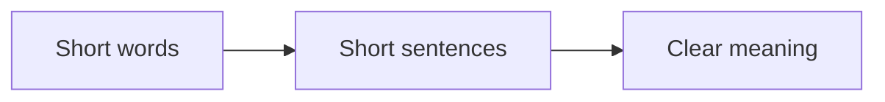
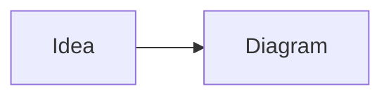
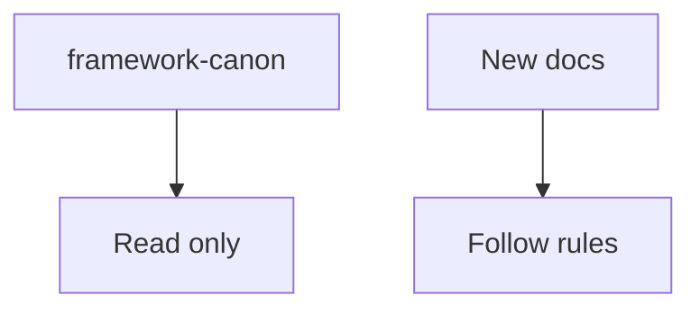
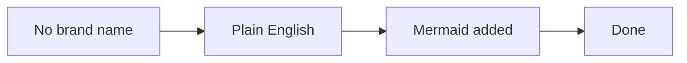

# AGENTS.md

Rules for anyone who helps build on this repo. This covers humans and AI
agents. Read this before you write or edit anything.

## 1. Naming rule (most important)

The source transcripts in `framework-canon/` use a brand name for the original
method. **Never write that brand name in any new file.**

- Always call it **the framework** or **the system**.
- Our own version is the **RED Method**: Refine Offer, Engage Opportunity,
  Develop Audience.
- Do not use the original brand name in prose, headings, file names, diagrams,
  commit messages, or examples.
- Do not copy quotes that contain the brand name. Rewrite them.
- If you find the brand name in a new doc, replace it with "the framework".

`framework-canon/` is the scrubbed canon. Do not edit its files by hand. Use
the `scrub` tool for bulk name changes. It stays local and ignored. Never
commit it.

## 2. Writing standards

Write for a 3rd to 5th grade reading level. Keep it simple and clear.

- Use plain, standard technical English.
- Keep sentences short. One idea per sentence.
- Use common words. Avoid jargon.
- Define a term the first time you use it.
- Use the active voice.
- Use "you" to speak to the reader.
- Use lists and steps for anything with more than two parts.
- Do not use slang, idioms, or hype.

## 3. Diagrams in Markdown

Use Mermaid for diagrams in Markdown files (`.md`). This rule is for files in
this repo. It does not apply to chat, terminal output, or any other response.
Keep each one small and easy to read.

- Prefer simple charts. Flowcharts, pie charts, and journeys work well.
- Keep most diagrams to fewer than 5 elements. Do not count lines or labels.
- Add many small diagrams instead of one large one.
- Give every diagram a short lead-in sentence.
- Label nodes with short, plain words.

## 4. Repo rules

- `framework-canon/` is read only. Never edit, rename, or delete its files by
  hand. Use the `scrub` tool for changes. See `README-scrub.md`.
- Put new material at the repo root or in a new, clearly named folder.
- Keep file names short and in plain English.
- Public docs in `docs/` must not mention the source transcripts, session
  numbers, or internal gaps. Keep that machinery in `internal/`.
- Update `README.md` when the repo structure changes.
- Do not add secrets, keys, or client data.

## 5. Voice and point of view

- Use **we** for our company.
- Use **you** for the reader.
- Use **the framework** or **the system** for the method.
- Do not name people from the transcripts in new material.
- Keep a calm, helpful, expert tone.

## 6. Commits

- Use `type(scope): message` form, like `docs(readme): add offer section`.
- Keep the subject short and in the imperative mood.
- Keep one change set per commit.

## 7. Check before you ship

Before you finish:

- [ ] No original brand name appears in your new files.
- [ ] The text reads at a 3rd to 5th grade level.
- [ ] New ideas in `.md` files have a simple Mermaid diagram.
- [ ] Public docs do not mention session numbers or internal gaps.
- [ ] `framework-canon/` was not touched.
- [ ] The commit message follows the form above.
