# Overview

This document is a full map of the canon. The canon is the set of source
transcripts in `framework-canon/`. Those transcripts teach **the framework**
(also called **the system**).

We do not publish the transcripts. We study them. This document shows what the
whole set teaches and how the parts fit together.

Think of the canon as one **assembly line**. Raw knowledge goes in one end. A
clear, repeatable service business comes out the other end. Then a long-term
partnership grows from that business. Along the way, assets pile up.

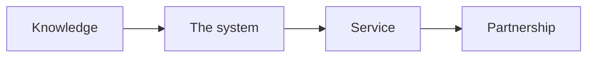

## Who this document is for

- Our team. It is the shared picture of how the work fits together.
- New helpers. It is the fastest way to learn the whole method.
- Partners. It shows how we run the framework as the **RED Method**.

RED stands for Refine Offer, Engage Opportunity, Develop Audience.

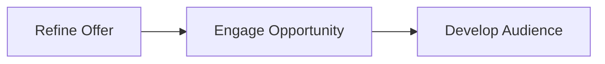

## How to read this document

Read the parts in order. Each part builds on the one before it.

1. The canon and the big idea.
2. The assembly line, station by station.
3. The service we deliver to the client.
4. The long-term partnership.
5. The asset portfolio that grows.
6. Gates, metrics, cadence, and the session index.

## 1. What the canon is

The canon holds 33 transcripts. They are numbered 00 to 34. Numbers 19 and 20
are missing. Sessions 13 and 14 are copies of each other.

The set teaches a 12-week program. In that program an expert turns what they
know into a product they can sell and deliver. The work moves from research to
message to offer to funnel to traffic to content to follow up.

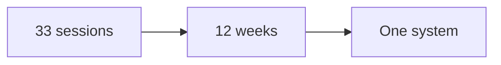

Two things are true about the canon:

- It is very strong on getting new clients.
- It is thinner on what happens after a client buys. Part 5 of this document
  shows where our service fills that space.

## 2. The big idea

Most experts sell their time. That makes the expert the bottleneck. The system
packs knowledge into a product. A product can be sold and delivered again and
again without the expert doing every step by hand.

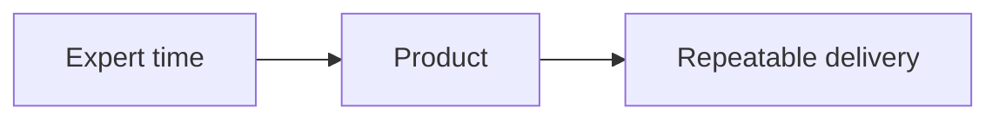

There are two clients in this picture. Keep them clear.

- Our client: the expert. We help them build the system.
- Their client: the end customer. The expert serves them.

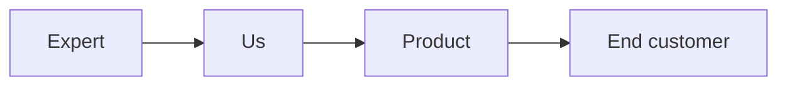

### The five pillars

Every part of the canon hangs on five ideas. Get these right and the rest is
mostly fill in the blank.

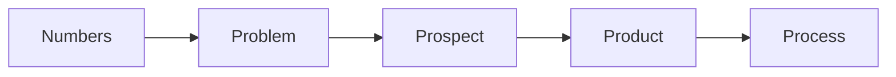

- **Numbers**: what a lead, a session, and a client are worth.
- **Problem**: the one problem you solve.
- **Prospect**: the one person you serve.
- **Product**: how you package and price the work.
- **Process**: how you find, win, and serve people.

### The thread that holds it together

One idea runs through the whole system: **one currency**. A currency is the one
measured result you sell. For example: leads, customers, pounds lost, or profit.

If every part of the business speaks that one result, nothing is confusing.

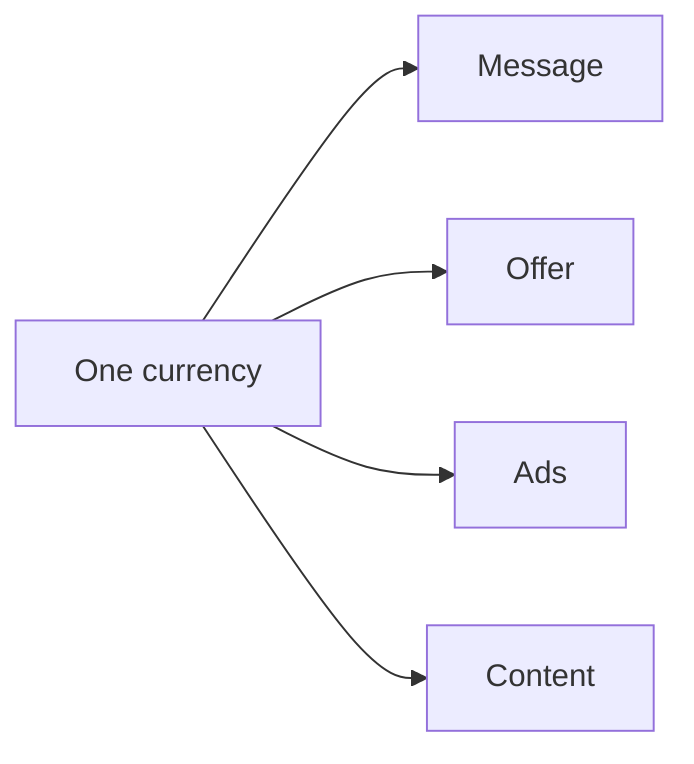

## 3. The journey at a glance

The full journey has five runs. The canon builds the first three. We add the
last two as a managed service and a partnership.

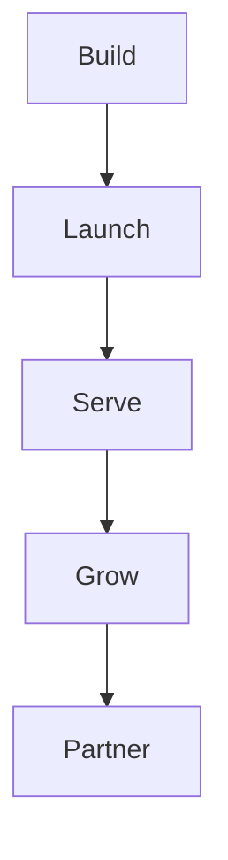

- **Build**: make the offer, the message, and the funnel.
- **Launch**: turn on paid traffic and content.
- **Serve**: deliver the product and get results.
- **Grow**: add content, follow up, and referrals.
- **Partner**: keep them long term as the assets grow.

## 4. The build line, station by station

The build line is the 12-week program. Each station has one job. Each station
has an output. Each station has a gate you must pass before moving on.

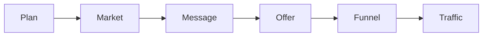

### Station 0: Plan

**Goal**: agree on the numbers and the plan.

**What happens**:

- Set a simple one-page plan.
- Set goals for revenue and clients.
- Learn the numbers: cost per lead, cost per session, cost per client, and the
  value of a client.
- Review the plan every 90 days.

**What comes out**: a one-page plan with clear numbers.

**The gate**: the plan is specific and measurable. It gets reviewed on a
schedule. It does not sit on a shelf.

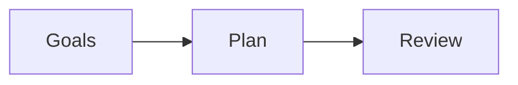

**Sessions**: 00, 01.

### Station 1: Market and avatar

**Goal**: find the one market you can reach and serve.

**What happens**:

- Size the market on social and business networks.
- Study the top pains, goals, and fears of the buyer.
- Check the market has profit, presence, and a path to reach people.
- Narrow many possible markets down to one.

**What comes out**: an avatar snapshot and a goals grid.

**The gate**: the market is big enough, reachable, and has a problem worth
solving.

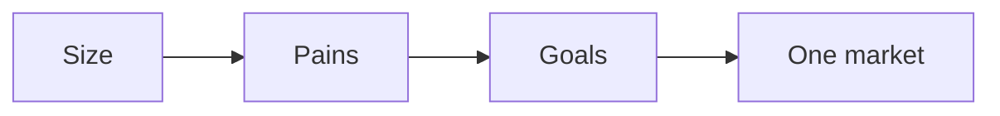

**Sessions**: 02, 03, 04.

### Station 2: Message

**Goal**: turn a category into one currency and one clear message.

**What happens**:

- List every result you could sell.
- Pick the one result that is critical and specific.
- Give it a metric and a timeline.
- Name the three main obstacles the buyer faces.
- Write one message that ties the person, the result, and the time together.

**What comes out**: a currency calculator and a message.

**The gate**: one currency, one word if possible. The message must have a
metric and a timeline. It must be approved before moving on. This is the
hardest gate in the whole line.

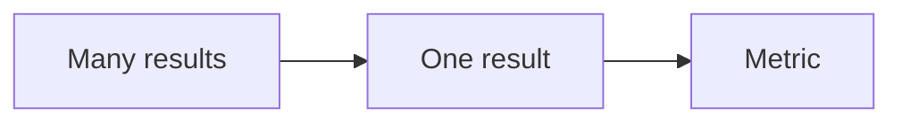

**Sessions**: 05, 06.

### Station 3: Offer and price

**Goal**: package the work into a product with a price.

**What happens**:

- Split the market into four levels by success.
- Choose which levels you serve and which you do not.
- Build a visual path from the buyer's pain to the goal.
- Choose how you deliver: group program, one-to-one, or done for you.
- Set a premium price.
- Outline a 6 to 12 week program, one module per week.

**What comes out**:

- A profit pyramid (the four levels).
- A signature solution (a 3-phase, 9-step path).
- A product outline and a price.

**The gate**: the offer uses the one currency. Each level has one clear action.
The path has three phases and nine steps. Get feedback before design.

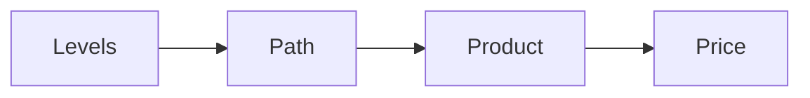

**Sessions**: 07, 08, 09, 10, 11, 12.

### Station 4: Funnel

**Goal**: build the simple path that turns a stranger into a booked call.

**What happens**:

- Make a short video that shows the signature solution.
- Use a six-part script: promise, proof, problems, steps, context, action.
- Build four pages: opt in, video, calendar, confirmation.
- Add branding, slides, recording, and editing.
- Add a homework video so people show up ready.

**What comes out**: a live funnel and a finished authority video.

**The gate**: the script is right before the slides. The funnel captures,
engages, and converts. Pages follow a clean brand.

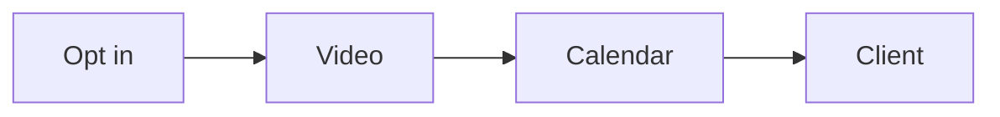

**Sessions**: 13, 14, 15, 16, 17, 18, 21.

### Station 5: Traffic

**Goal**: turn on paid ads the right way.

**What happens**:

- Set up tracking, audiences, and goals.
- Build a simple campaign: campaign, ad set, ad.
- Launch and then leave it alone for about 10 days.
- Watch a few key numbers.
- Change only one thing at a time.

**What comes out**: a live ad campaign and a metrics dashboard.

**The gate**: enough leads per day to learn. Do not touch a new campaign too
early. Only fix things up the funnel, one step at a time.

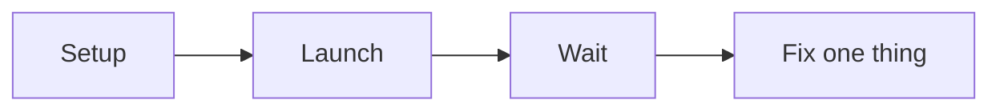

**Sessions**: 22, 23, 24.

### Station 6: Content engine

**Goal**: build an audience with content that lives inside the offer.

**What happens**:

- Turn the nine steps of the offer into a content list.
- Plan, produce, publish, promote, and syndicate.
- Reuse one asset in many places.
- Build retargeting audiences from video views.

**What comes out**: a content roadmap and a growing audience.

**The gate**: every piece of content lives inside the signature solution. Never
start from a blank page. Never post only once.

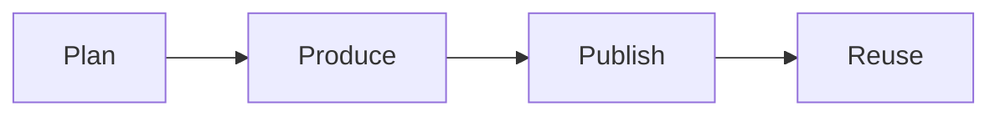

**Sessions**: 25, 26, 27, 28, 29, 30, 31, 32.

### Station 7: Retargeting

**Goal**: bring back the people who got stuck.

**What happens**:

- Add tracking and goals.
- Split audiences by where they stopped.
- Show a focused ad to each group.
- Measure and repeat.

**What comes out**: a retargeting plan and a set of ads.

**The gate**: follow the six steps in order. Target, exclude, and ignore the
right people.

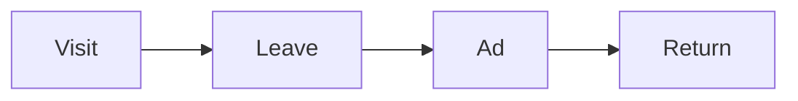

**Sessions**: 33, 34.

## 5. The run line

The build line ends. The run line begins. The run line never really stops.

Three engines run at the same time:

- **Paid traffic**: brings new leads on demand.
- **Content**: brings leads over time and builds trust.
- **Retargeting**: recovers people who did not act.

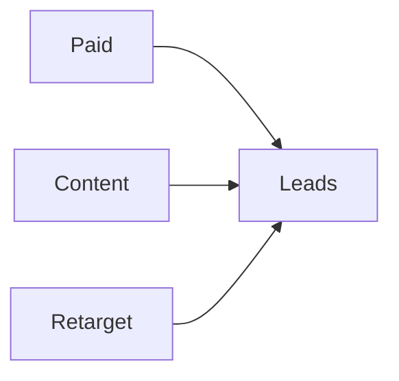

The run line has rules:

- Watch the numbers every week.
- Change one variable at a time.
- Keep content inside the offer.
- Keep retargeting on for every step of the funnel.

The canon says the retargeting lists only get bigger. So does the content
library. That is the start of the asset portfolio.

## 6. The service line

The canon builds the machine. The service line is where we run it for the
client as a white-glove service. This is our layer. The canon is thin here, so
we define it.

**Goal**: deliver the product and create real results.

**What happens**:

- Onboard the client with a clear welcome and a kickoff.
- Set success goals and a start date.
- Deliver one module per week for 6 to 12 weeks.
- Teach on one day and coach on another.
- Track attendance, progress, and results.
- Collect a case study the moment results land.

**What comes out**: client results, a case study, and a reference.

**The gate**: results are measured against the goals set at kickoff.

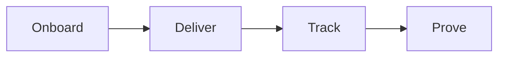

This layer needs a few things the canon does not spell out. We add them:

- A kickoff checklist.
- A module production standard.
- A session guide for the coach.
- A simple scorecard for each client.
- A case study template.

## 7. The partnership line

A one-time program is a project. A partnership is a relationship. This is our
long-term layer.

**Goal**: keep the client for years as their results and assets grow.

**What happens**:

- Hold regular check-ins.
- Watch for clients who are quiet or stuck.
- Offer the next step at the right time.
- Build a community of clients.
- Ask happy clients for referrals.
- Renew and expand the work.

**What comes out**: longer client life, more revenue per client, and advocates.

**The gate**: every client has a next step and a reason to stay.

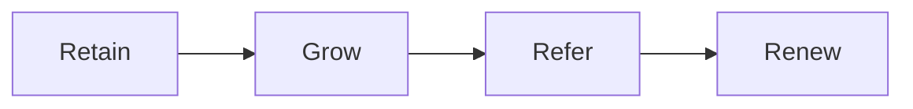

The canon hints at this but does not build it. So we add:

- A renewal and win-back plan.
- A clear next-offer path.
- A referral and partner plan.
- A client community with simple rules.
- A reputation track: reviews, stories, and press.

## 8. The asset portfolio

An asset is something that keeps working after you build it. The canon creates
many assets. Over time they stack up. This is the portfolio.

```mermaid
flowchart LR
    A[Build assets] --> B[Assets work] --> C[More assets]
```

Here is each asset and how it grows.

| Asset | Where it comes from | How it grows | What we do with it |
|---|---|---|---|
| One currency | Message work | It sharpens with each test | It guides every message |
| Signature solution | Offer work | It collects examples and proof | It becomes the program |
| Program content | Offer work | One module a week | It is the product |
| Funnel | Funnel work | Small tests improve it | It wins clients |
| Authority video | Funnel work | New versions over time | It warms cold leads |
| Audience | Traffic and content | Lists only get bigger | It is the fuel |
| Content library | Content work | One asset becomes many | It brings leads for years |
| Retargeting lists | Ads and content | They keep filling | They recover lost leads |
| Results and stories | Delivery | Each client adds proof | They build trust |
| Reputation | All of the above | It compounds | It lowers ad cost |

### The compounding loop

Each turn of the loop makes the next turn stronger.

```mermaid
flowchart LR
    A[Content] --> B[Audience]
    B --> C[Clients]
    C --> D[Results]
    D --> A
```

One real result becomes a story. A story becomes content. Content brings an
audience. The audience brings clients. The loop repeats. Each pass is worth
more than the last.

## 9. Cadence and sequencing

The canon is strict about order and timing. Do the steps in order. Do not skip.
Do not work ahead.

```mermaid
flowchart LR
    A[One step] --> B[Next step] --> C[Feedback] --> D[Then move on]
```

Key timing in the canon:

- The build is 12 weeks.
- The plan is reviewed every 90 days.
- The product runs 6 to 12 weeks, one module per week.
- Pre-sell clients 6 to 8 weeks before the start.
- A new ad campaign is left alone for about 10 days.
- Retargeting uses a 30-day window by default.
- Content is shared every few days.
- Calls are booked within 72 hours.

Hard rules:

- Do not pass the message station until one currency is approved.
- Do not design the offer before the shape is reviewed.
- Do not make slides before the script is right.
- Never make content outside the signature solution.
- Change one ad variable at a time.

## 10. Gates and metrics

A gate is a check. You must pass it to move on. A metric is a number you watch.
The numbers below are examples from the canon. Use them as targets, not
promises.

| Station | Gate to pass | Metric to watch |
|---|---|---|
| Plan | Plan is specific and reviewed | Client value, cost per lead |
| Market | Market is big and reachable | Audience size |
| Message | One currency, approved | Metric and timeline |
| Offer | Path has three phases, nine steps | Price, conversion rate |
| Funnel | Script right, pages live | Page conversion, show rate |
| Traffic | Enough leads to learn | Cost per lead, return on ad spend |
| Content | Content fits the offer | Views, visits, audience growth |
| Retargeting | Six steps in order | Return on ad spend lift |
| Service | Results match goals | Completion, results |
| Partnership | Every client has a next step | Renewal, referrals |

```mermaid
flowchart LR
    A[Build] --> B[Check] --> C[Pass] --> D[Move on]
```

## 11. Corpus index

This table maps every session to a station and its main output.

| Session | Topic | Station | Main output |
|---|---|---|---|
| 00 | Getting started | Plan | Program map |
| 01 | Plan and goals | Plan | One-page plan |
| 02 | Audience sizing, social | Market | Audience size |
| 03 | Audience sizing, network | Market | Audience size |
| 04 | Avatar goals grid | Market | Avatar goals grid |
| 05 | Message intro | Message | Rough message |
| 06 | Currency and message | Message | Currency and message |
| 07 | Profit pyramid | Offer | Four levels |
| 08 | Pyramid examples | Offer | Final pyramid |
| 09 | Signature solution | Offer | Three phases, nine steps |
| 10 | Solution examples | Offer | Final solution |
| 11 | Product and price | Offer | Product outline |
| 12 | Product examples | Offer | Price and structure |
| 13 | Authority amplifier 1 | Funnel | Script outline |
| 14 | Authority amplifier 1 copy | Funnel | Script outline |
| 15 | Authority amplifier 2 | Funnel | Full script |
| 16 | Slide template | Funnel | Slide deck |
| 17 | Branding images | Funnel | Branded slides |
| 18 | Recording and editing | Funnel | Finished video |
| 21 | Funnel template | Funnel | Live funnel |
| 22 | Paid ads quick start | Traffic | Live campaign |
| 23 | Metrics dashboard | Traffic | Metrics sheet |
| 24 | Q and A | Traffic | Fixed funnel |
| 25 | Content blitz | Content | One video |
| 26 | Content intro | Content | Roadmap |
| 27 | Content plan | Content | Filled roadmap |
| 28 | Content produce | Content | Finished video |
| 29 | Content publish | Content | Post on three places |
| 30 | Content promote | Content | Audience campaign |
| 31 | Content syndicate | Content | Sharing queue |
| 32 | Winning webinar | Content | Webinar outline |
| 33 | Retargeting intro | Retargeting | Retargeting plan |
| 34 | Retargeting training | Retargeting | Live retargeting |

Note: sessions 13 and 14 are copies. Sessions 19 and 20 are missing.

## 12. What the canon does not cover

The canon is a full acquisition line. It is light on the back half of the
client life. We fill these gaps in our service and partnership layers.

- Client onboarding after purchase.
- Day-to-day delivery and session management.
- Client success tracking and check-ins.
- Renewal, retention, and win-back.
- A clear next-offer path.
- Referral and partner programs.
- Community building and moderation.
- Team hiring, training, and sales support.
- Contracts, billing, and payment plans.
- Long-term data: cohorts and client lifetime value.
- Offboarding and alumni.

```mermaid
flowchart LR
    A[Canon] --> B[Acquisition]
    A --> C[Back half]
    C --> D[Our layers]
```

## 13. How this maps to the RED Method

Our version of the framework is the RED Method. The assembly line maps to it.

```mermaid
flowchart TD
    A[The system] --> B[Refine Offer]
    A --> C[Engage Opportunity]
    A --> D[Develop Audience]
```

| RED step | Stations |
|---|---|
| Refine Offer | Plan, Market, Message, Offer |
| Engage Opportunity | Funnel, Traffic, Retargeting |
| Develop Audience | Content, Service, Partnership |

- **Refine Offer** makes the thing worth buying.
- **Engage Opportunity** turns interest into a client.
- **Develop Audience** keeps the audience and the client growing over time.

## 14. Glossary

- **Asset**: something that keeps working after you build it.
- **Avatar**: the one person you serve.
- **Authority video**: a short video that shows your offer and builds trust.
- **Currency**: the one measured result you sell.
- **Funnel**: the steps that turn a stranger into a booked call.
- **Gate**: a check you pass before moving to the next station.
- **Lead**: a person who gave you their contact details.
- **Metric**: a number you watch to judge progress.
- **Offer**: the product you sell and the price.
- **Retargeting**: showing ads to people who already visited.
- **Signature solution**: the visual path from a buyer's pain to their goal.
- **The canon**: the source transcripts in `framework-canon/`.
- **The framework** or **the system**: the method taught by the canon.

## 15. What we build next

This document is the map. The next step is the detail. Each station above can
become its own playbook. For example:

- A playbook for the message station.
- A playbook for delivery and client success.
- A playbook for the partnership and renewal loop.

```mermaid
flowchart LR
    A[Overview] --> B[Playbooks] --> C[Training]
```

Every new document follows the same rules. Plain words. Short sentences. Small
diagrams. No original brand name. Use "the framework" or "the system".
