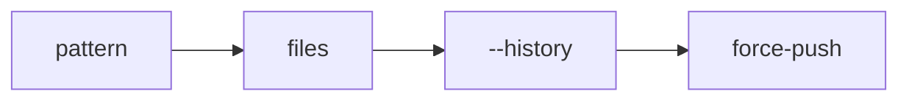

# scrub

`scrub` is a small regex tool. It replaces text in files and in git history.

Use it to hide a brand name, a person name, or any other term. It works on file
contents and on old commits.

## Run it

From the repo root:

```bash
uv run scrub 'old text' 'new text'
```

That changes the working tree. It is case-insensitive by default.

### Also rewrite git history

```bash
uv run scrub --history --force 'old text' 'new text'
```

History mode rewrites file contents in every commit and, by default, commit
messages too. It uses `git-filter-repo`. After it runs, force-push the branch.

### Show changes first

```bash
uv run scrub --dry-run 'old text' 'new text'
```

## Rules files

For many rules, use a file. One rule per line:

```
# comment
old text ==> new text
regex:foo\s+bar ==> baz
case:Exact Case ==> Exact
```

```bash
uv run scrub --rules my.rules --history --force
```

- Case-insensitive by default. Start a line with `case:` to match case.
- The pattern is a Python regex.
- Keep rules files out of git if they hold a secret term.

## Common flags



- `--path DIR`: root to scan. Default `.`.
- `--include GLOB`: only these files. Repeatable.
- `--exclude GLOB`: skip these files. Repeatable.
- `--case-sensitive`: match case.
- `--dry-run`: show changes, write nothing.
- `--history`: rewrite git history.
- `--no-messages`: with `--history`, leave commit messages alone.
- `--force`: allow a rewrite on a repo that is not a fresh clone.

## polish

`polish` is a second routine. It applies a built-in set of small grammar fixes
to files. It does not touch git history.

```bash
uv run polish
uv run polish --dry-run
uv run polish --rules extra.rules
```

- The built-in rules live at `src/scrub/polish_rules.txt`.
- The routine always skips its own source folder.
- Use `--path`, `--include`, and `--exclude` the same way as `scrub`.
