# Red Canon

This repo is the source archive for our business training system. It holds the
raw seminar transcripts that teach **the framework** (also called **the system**).
We use it to build training, playbooks, and client material.

The framework helps experts turn what they know into a clear, repeatable
business. The goal is a business that is easy to consume, easy to deliver, and
easy to grow. The owner stays out of the bottleneck.

## What is in this repo

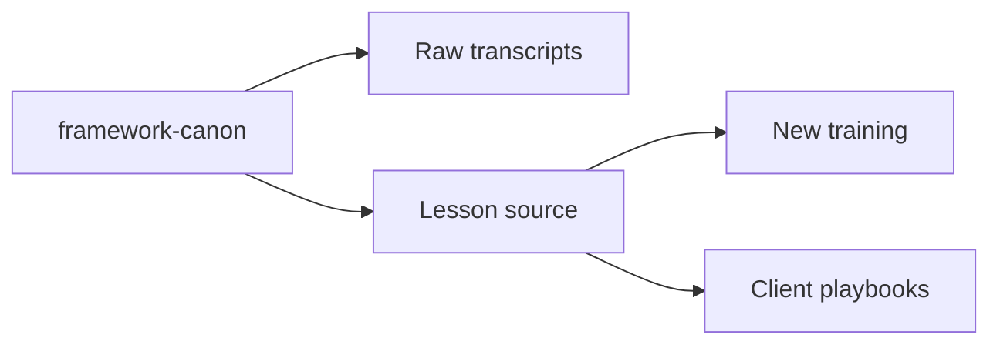

- `framework-canon/` holds the original lesson transcripts. Treat these as the
  source of truth. Do not edit them.
- New docs, playbooks, and training are built on top of the canon.

## The core idea

Most experts sell their time. That makes them the bottleneck. The framework
packages knowledge into a product. A product can be sold, taught, and delivered
again and again.

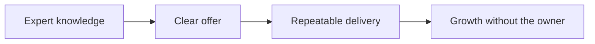

## The system at a glance

The framework is built from a few simple parts. Each part answers one question.

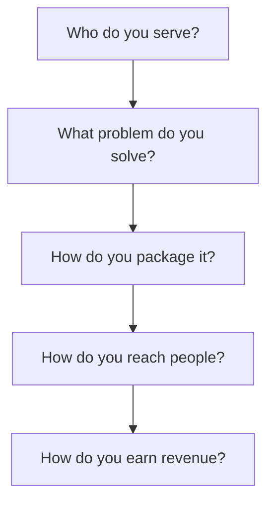

### Building blocks

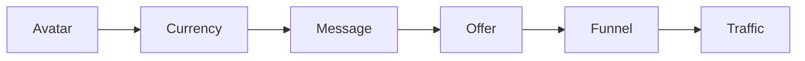

- **Avatar**: the exact person you serve.
- **Currency**: the one measured problem you solve, in their words.
- **Message**: one clear promise with a result, a metric, and a timeline.
- **Offer**: your packaged path from their pain to their goal.
- **Funnel**: the simple steps that turn a stranger into a client.
- **Traffic**: how new people find the offer.

### The client journey

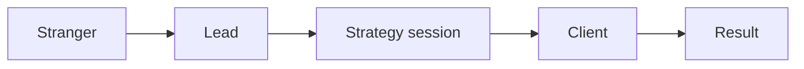

## Our way of running the framework: the RED Method

Our company runs a white glove implementation service of the framework. We call
our version the **RED Method**. RED stands for:

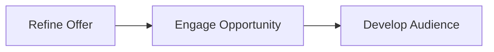

### Refine Offer

We help the client get clear on who they serve, the problem they solve, and the
offer they sell. No clear offer means no growth.

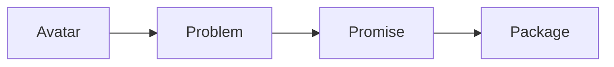

### Engage Opportunity

We build the path that turns a lead into a paying client. This covers the
message, the funnel, strategy sessions, and the sales talk.

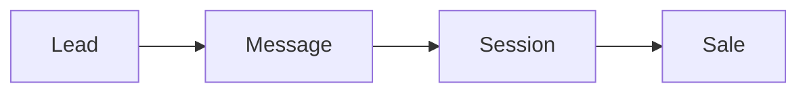

### Develop Audience

We help the client reach new people over time with content, paid ads, and
follow up. This is how the business grows without the owner doing it all.

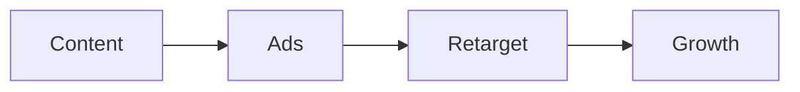

## How the RED Method maps to the system

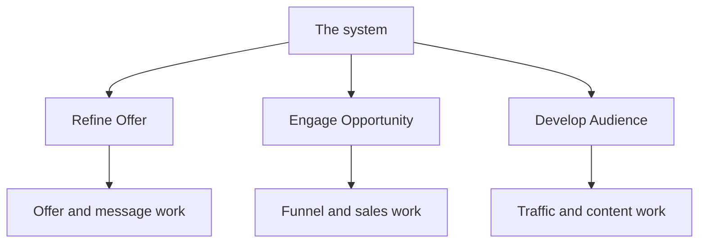

## Why clients work with us

- We do the hard setup with them. This is white glove, not a course.
- We remove the owner from the middle of the business.
- We keep the language simple so the whole team can follow it.

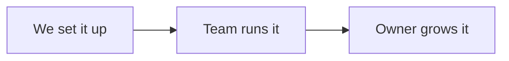

## Repo layout

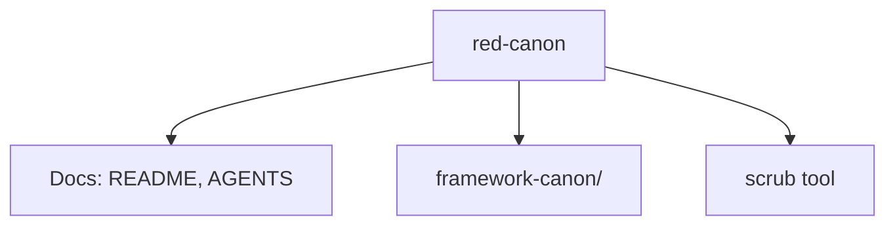

- `README.md`: this file. Start here.
- `AGENTS.md`: rules for anyone, human or AI, who helps build on this repo.
- `framework-canon/`: the source transcripts. Read only.
- `src/scrub/` and `pyproject.toml`: the `scrub` tool. See `README-scrub.md`.

## The canon: session list

The transcripts are grouped into loose learning tracks. Numbers match the file
names.

### Start here

- `00` Getting Started
- `01` Avatar Intro and Business Plan Overview
- `24` Recorded Q&A

### Track 1: Know the market

- `02` Facebook Audience Insights
- `03` LinkedIn Search
- `04` Avatar Goals Grid

### Track 2: Build the message

- `05` Message Intro
- `06` Currency Calculator and Message Frameworks

### Track 3: Build the offer

- `07` Profit Pyramid Training
- `08` Profit Pyramid Examples
- `09` Signature Solution Core Training
- `10` Signature Solution Examples
- `11` Perfect Product Core Training
- `12` Perfect Product Examples

### Track 4: Build the funnel

- `13` Authority Amplifier
- `14` Authority Amplifier Core Training Part 1
- `15` Authority Amplifier Core Training Part 2
- `16` Authority Amplifier Slide Template
- `17` Authority Amplifier Branding Images
- `18` Authority Amplifier Recording and Editing
- `21` Funnel Template

### Track 5: Build traffic

- `22` Facebook Quickstart
- `23` Mastery Advertising Dashboard
- `33` Retargeting Introduction
- `34` Retargeting Full Training

### Track 6: Grow with content

- `25` Content Blitz Challenge
- `26` Content Blitz Challenge Intro
- `27` Content Blitz Challenge Plan
- `28` Content Blitz Challenge Produce
- `29` Content Blitz Challenge Publish
- `30` Content Blitz Challenge Promote
- `31` Content Blitz Challenge Syndicate
- `32` Content Blitz Challenge Winning Webinar

## How to use this repo

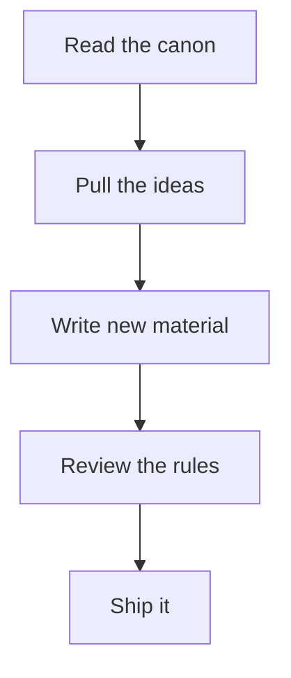

1. Read the matching transcript in `framework-canon/`.
2. Build new material from it.
3. Follow the writing and naming rules in `AGENTS.md`.
4. Open a change for review.

## Keeping the canon clean

The canon is scrubbed. It does not contain the original brand name. We use our
own `scrub` tool to keep it clean. The tool edits files and old commits.

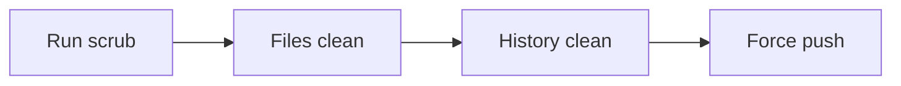

```bash
uv run scrub 'old text' 'new text'
uv run scrub --history --force 'old text' 'new text'
```

See `README-scrub.md` for all options.

## Provenance and license

The canon is licensed material. It is kept here for internal use only. Do not
share it outside the company.

All new docs and material must follow these naming rules:

- Call it **the framework** or **the system**.
- Never write the brand name of the original method.
- Our own version is called the **RED Method**.

See `AGENTS.md` for the full list of rules.
