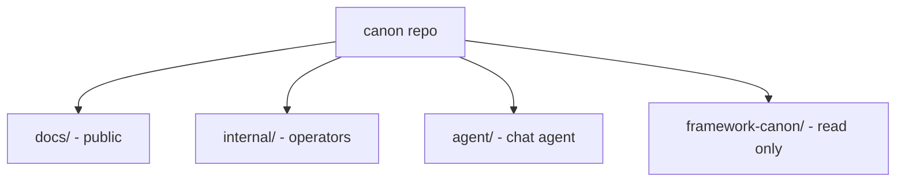

# Red Canon repo

This repo holds two kinds of writing, one agent plan, and one read-only
source set.



## What is where

- `docs/`: public docs. They explain the **RED Method** to clients and
  partners. The site is built from this folder.
- `internal/`: operator docs. They map the source sessions, stations, cadence,
  and our service playbooks. They are not part of the site.
- `agent/`: the canon chat agent. The spec (`agent/SPEC.md`), the agent
  prompt, the implementation plan, and the built code: an onion-architecture
  Python package (`agent/src/canon_chat/`) with 162 offline tests, the
  Pattern B `serverless.yml`, and the chat UI. Start at `agent/SPEC.md`.
- `framework-canon/`: the scrubbed source transcripts. It holds the 48-session
  core and nine more series (103 files). The core shares a folder with three
  accelerator files. Read only. Never edit, rename, or delete by hand. Use the
  `scrub` tool. See [README-scrub.md](README-scrub.md).

## Public docs

The public docs present our method as the RED Method. They do not mention the
source transcripts, session numbers, or internal gaps.

- `docs/index.md`: landing page.
- `docs/method/`: the big idea, the method map (three phases, nine motions,
  27 steps), the three phase pages, the money message, the product roadmap, how
  the numbers work, the enrollment evolution, and results.
- `docs/ops/`: the RED Method Enterprise operations manual. It holds the
  station playbooks, the asset playbooks, the checklists, and the SOPs our team
  uses to run the method. Start at `docs/ops/index.md`.
- `docs/programs/`: nine program summaries with Reveal.js slide decks. Each
  summary links to its deck. Start at `docs/programs/index.md`.
- `docs/glossary.md`: plain words for the terms we use.

## Internal docs

Internal docs keep the machinery that a client should never read.

- `internal/corpus-map.md`: what the source teaches and what it leaves out.
- `internal/canon-to-docs-map.md`: the trace from every canon idea to its public
  doc.
- `internal/stations.md`: station mechanics, gates, and metrics.
- `internal/cadence.md`: timing and hard rules.
- `internal/service-ops.md`: service and partnership layers, and what to build
  next.
- `internal/ops-spec.md`: the spec for the operations manual. It records the
  goal, the doc templates, and the acceptance criteria.

## Build the site

```bash
uv sync
uv run mkdocs serve
```

The site reads `docs/` only. `internal/` and `framework-canon/` stay off the
site.

## Rules

Read `AGENTS.md` before you write or edit anything. The short version:

- No original brand name. Call the method the **RED Method**.
- Plain words. Short sentences. 3rd to 5th grade reading level.
- Add a small Mermaid diagram to each new idea in a `.md` file.
- `framework-canon/` is read only.
