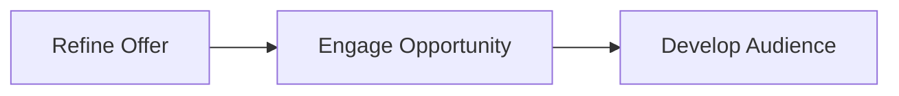
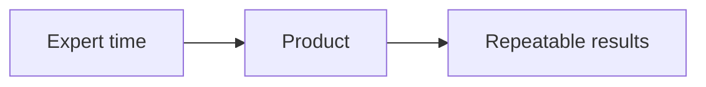
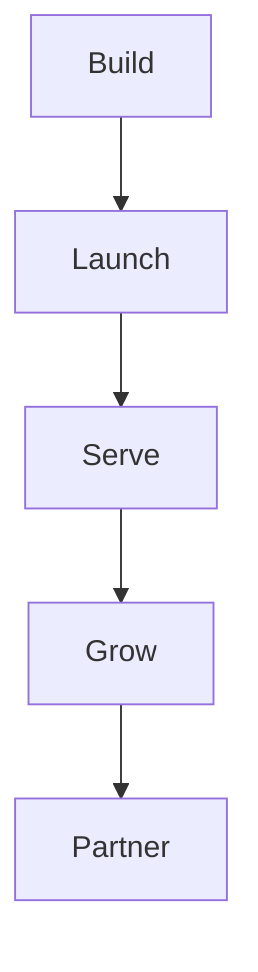

# The RED Method

The RED Method is how we turn an expert's knowledge into a product they can
sell and deliver, again and again.

RED stands for three phases.

- **Refine Offer**: make something worth buying.
- **Engage Opportunity**: turn interest into a paying client.
- **Develop Audience**: keep the audience and the RED portfolio growing.

Each phase has three motions. Each motion has three steps. The whole engagement
is exactly 27 steps. See [the method map](method/motions.md).

## Who this is for

- **Clients and partners.** You will see how we work and what you get.
- **Our team.** This is the shared picture of the method.

## Why it works

Most experts sell their time. That makes the expert the bottleneck. The RED
Method packs what the expert knows into a product. A product can be sold and
delivered many times.

## The five stages

The work shows up over time as five stages: Build, Launch, Serve, Grow, and
Partner. The stages materialize the motions. We stay with you for all five.

- **Build**: organize your knowledge into an offer, a message, and a funnel.
- **Launch**: turn on ads and content.
- **Serve**: build the Client Engine that gets results.
- **Grow**: add content, follow up, and referrals.
- **Partner**: keep the results growing for years.

## Where to go next

1. [The big idea](method/big-idea.md): the five pillars and one currency.
2. [The method map](method/motions.md): three phases, nine motions, 27 steps.
3. [Refine Offer](method/refine-offer.md): position, message, offer.
4. [Engage Opportunity](method/engage-opportunity.md): funnel, traffic,
   retargeting.
5. [Develop Audience](method/develop-audience.md): content, activate, expand.
6. [Results](method/results.md): the assets that keep working.
7. [Glossary](glossary.md): plain words for the terms we use.
