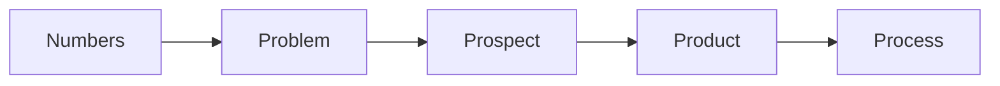
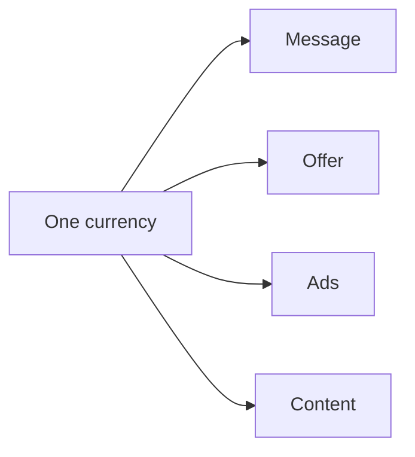

# The big idea

Most experts sell their time. That makes the expert the bottleneck. The RED
Method packs knowledge into a product. A product can be sold and delivered
again and again without the expert doing every step by hand.

## Two clients

There are two clients in this picture. We keep them clear.

- **Our client**: the expert. We organize their IP and build their system.
- **Their client**: the end customer. The expert serves them. We do not.

We build the machine. The expert runs it with their customers.

## The five pillars

Every part of the method hangs on five ideas. Get these right and the rest is
mostly fill in the blank.

- **Numbers**: what a lead, a session, and a client are worth.
- **Problem**: the one problem you solve.
- **Prospect**: the one person you serve.
- **Product**: how you package and price the work.
- **Process**: how you find, win, and serve people.

## One currency

One idea runs through the whole method: **one currency**. A currency is the one
measured result you sell. For example: leads, customers, pounds lost, or profit.

If every part of the business speaks that one result, nothing is confusing.

