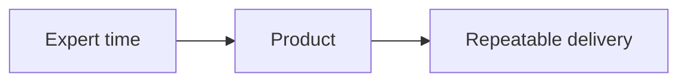
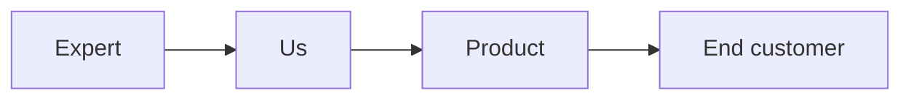
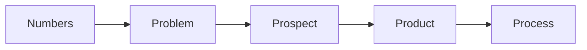
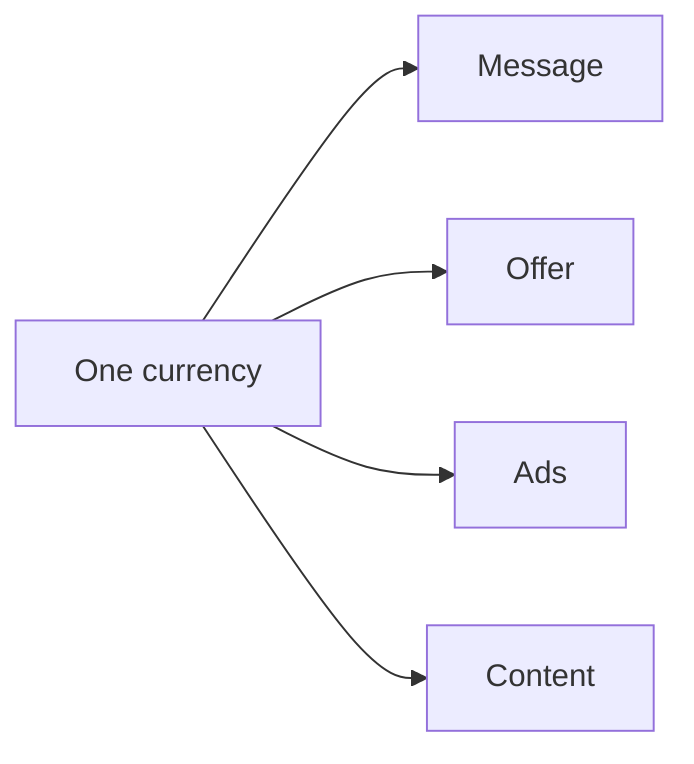
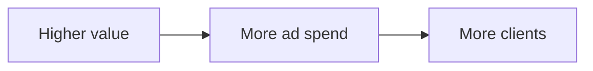
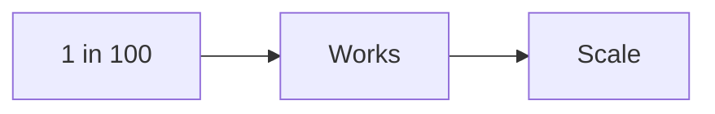
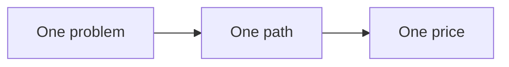
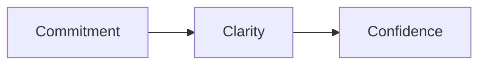
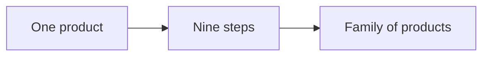

# The big idea

Most experts sell their time. That makes the expert the bottleneck. The RED
Method packs knowledge into a product. A product can be sold and delivered
again and again without the expert doing every step by hand.

The method has three phases, nine motions, and 27 steps. See [the method
map](motions.md).

## Two clients

There are two clients in this picture. We keep them clear.

- **Our client**: the expert. We organize their IP and build their system.
- **Their client**: the end customer. The expert serves them. We do not.

We build the machine. The expert runs it with their customers.

## The five pillars

Every part of the method hangs on five ideas. Get these right and the rest is
mostly fill in the blank.

- **Numbers**: what a lead, a session, and a client are worth.
- **Problem**: the one problem you solve.
- **Prospect**: the one person you serve.
- **Product**: how you package and price the work.
- **Process**: how you find, win, and serve people.

## One currency

One idea runs through the whole method: **one currency**. A currency is the one
measured result you sell. For example: leads, customers, pounds lost, or profit.

If every part of the business speaks that one result, nothing is confusing.

## The one number that matters

The master number is the **lifetime value** of a client. It is what one client
is worth over time. When this number goes up, everything else gets easier. You
can pay more for a lead. You can run more ads. You can grow faster.

There is a simple planning rule behind this. Plan for about **one lead in one
hundred** to buy. If the business works at 1%, it works at any higher rate.

## What makes a strong offer

A strong offer solves one important problem for one person. It is:

- **Singular**: one problem, one path.
- **Sequential**: the steps come in a clear order.
- **Productized**: a fixed result, not open-ended time.
- **Essential**: a painkiller, not a vitamin.

## The three C's

A buyer decides when they have all three:

- **Commitment**: they want to fix the problem.
- **Clarity**: they see the plan.
- **Confidence**: they believe they can do it.

## Every step can become a product

This is called **marketing inception**. The signature solution has nine steps.
Each step can become its own small product, lead magnet, or lesson. One product
becomes a family.

## A note on the numbers

Numbers in this method are targets, not promises. Your results will depend on
your market, your offer, and your work. We use them to plan and to spot a weak
step.
