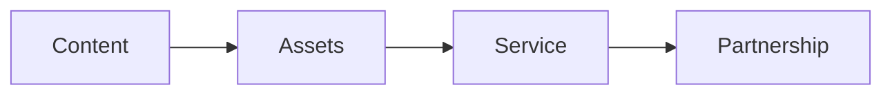
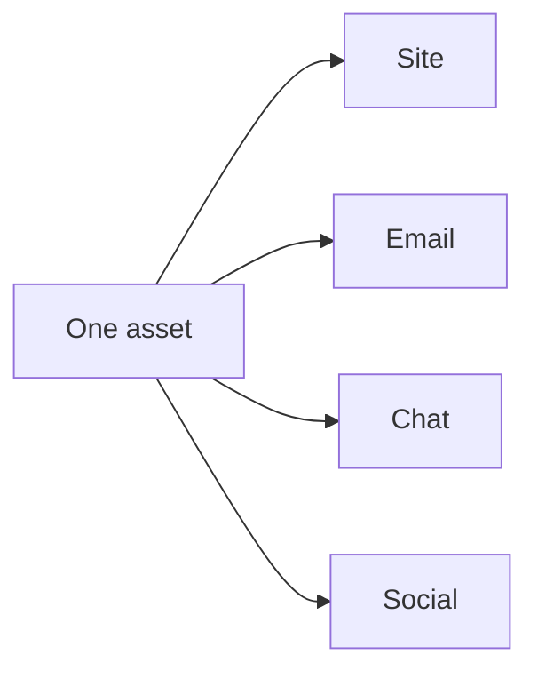
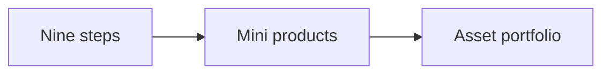
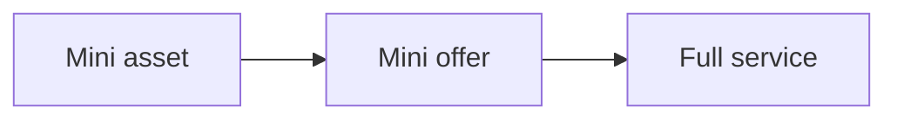
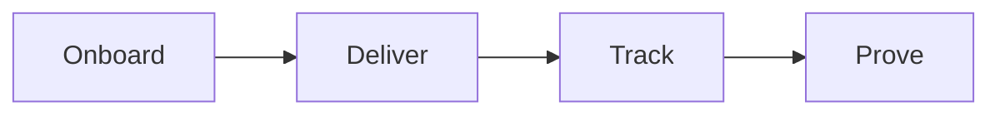
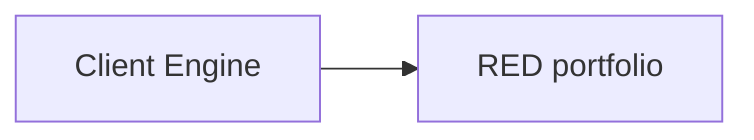
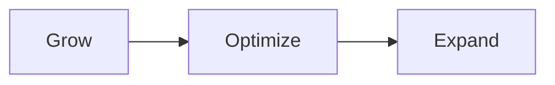

# Develop Audience

Develop Audience is the third step of the RED Method. Here we keep the audience
and the client growing. We run the content engine, deliver the product, and
build a long partnership.

## Content engine

We build an audience with content that lives inside the offer.

- We turn the nine steps of the offer into a content list.
- We plan, produce, publish, promote, and syndicate.
- We publish on your site, by email, in chat, and on social media.
- We reuse one asset in many places.
- We build retargeting audiences from video views.

Every piece of content lives inside the signature solution. We never start from
a blank page, and we never post only once.

## From steps to assets

The signature solution has three phases and nine steps. Each step can become
more than a lesson. Each step can become its own small product.

- **Mini product**: a short course, tool, or workshop that solves one step.
- **Mini offer**: a paid audit, review, or done-for-you service for one step.
- **Mini asset**: a template, checklist, calculator, or video set for one step.

Each mini product speaks the one currency. Each one lands in the Asset
Portfolio. Each one keeps working after you build it.

Nothing stands alone. Each mini product, tool, or offer is an entry point and
an upgrade path to your full service.

- Each asset points to the next step.
- Each asset can promote the others.
- Each transition moves the client up to a higher ticket offer.

Over time, one signature solution becomes a family of products that support
each other. That family is the base of your ongoing partnership with us.

## Service

We deliver the product for you, one client at a time. This is white glove,
one-to-one work.

- We onboard you with a clear welcome and a kickoff.
- We set success goals together.
- We deliver the program module by module.
- We track progress and results.
- We collect a case study the moment results land.

You get client results, a case study, and a reference.

## Partnership

You start with the Client Engine. The Client Engine is the first output of your
engagement with us: the five motions of Build, Launch, Serve, Grow, and Partner.
It is the first asset in your RED portfolio. It is the baseline.

The ongoing partnership then keeps working on your portfolio in three ways.

- **Optimize**: test and sharpen the assets that work.
- **Expand**: turn assets into new offers and new revenue.
- **Grow**: add new assets from the nine steps.

Your IP is the ideas and materials you own. Ongoing work raises the commercial
value of the IP in your RED portfolio.

Next: [Results](results.md).
