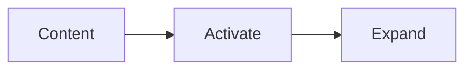
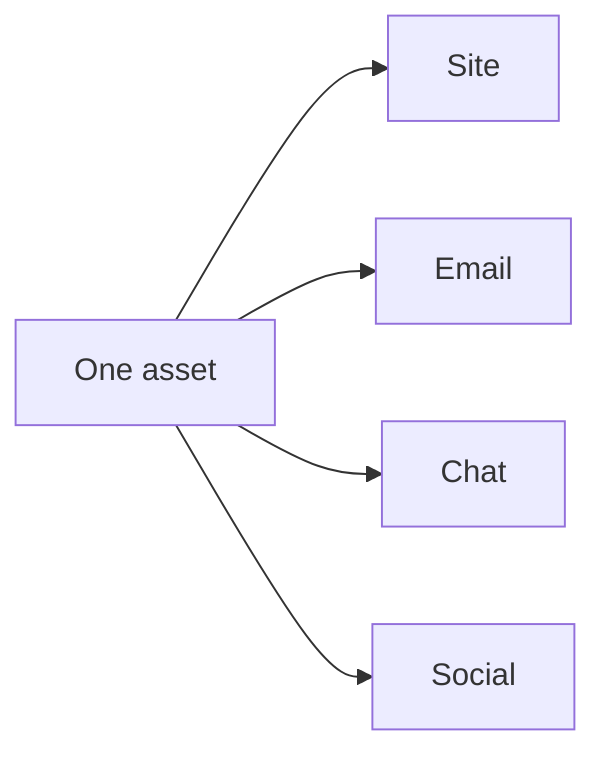
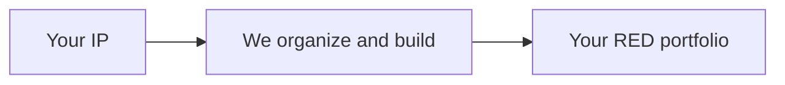
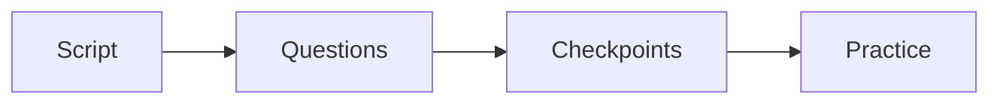
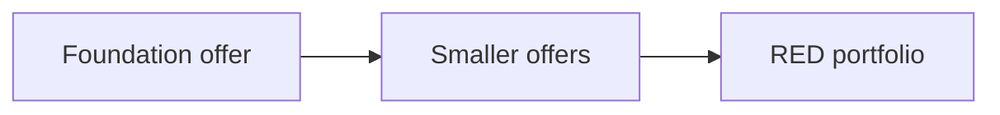
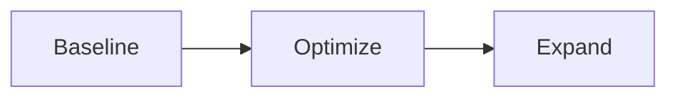
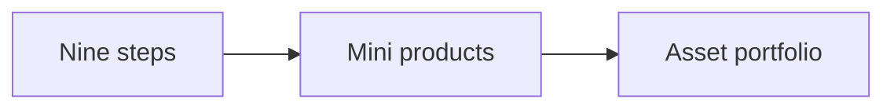
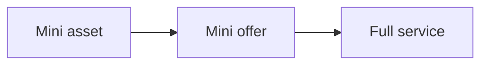

# Develop Audience

Develop Audience is the third phase of the RED Method. Here we keep the
audience and your RED portfolio growing. The phase has three motions: Content,
Activate, and Expand. Each motion has three steps.

## Motion 7: Content

We build an audience with content that lives inside the offer.

1. **Turn nine steps into a content list.** We turn the signature solution's
   nine steps into a content list. We plan, produce, publish, promote, and
   syndicate.
2. **Publish on site, email, chat, and social.** We publish on your site, by
   email, in chat, and on social media. One asset is reused in many places.
3. **Promote and reuse.** We build retargeting audiences from video views. We
   never start from a blank page, and we never post only once.

## Motion 8: Activate

We build the machine for you. This is done for you, white glove work.

1. **Organize IP as the signature solution.** We organize your commercial IP as
   a signature solution: a visual path from the buyer's pain to their goal.
2. **Build the Client Engine and promo assets.** We build the Client Engine and
   the assets that promote your offer.
3. **Launch and tune promotions.** We launch the promotions and watch the
   numbers. We keep what works.

We also design and implement your enrollment script. That means the words, the
questions, and the checkpoints your team uses on the call. We practice it with
you until it feels natural, not pushy.

We do not serve your customers. That work stays with you. We build the machine.
You run it with your customers.

## Motion 9: Expand

We turn a working machine into a growing portfolio.

We break the foundation offer into smaller offers that feed it. Each smaller
offer is a new entry point. It can win a new client, serve an existing one, or
raise customer lifetime value.

1. **Baseline the RED portfolio.** The Client Engine is the first output of
   your engagement: the five stages of Build, Launch, Serve, Grow, and Partner.
   It is the first asset in your RED portfolio. It is the baseline.
2. **Optimize what works.** We test and sharpen the assets that work.
3. **Expand the IP.** We turn assets into new offers and new revenue. Ongoing
   work raises the commercial value of the IP in your RED portfolio.

### From steps to assets

The signature solution's nine steps can become more than lessons. Each step can
become its own small product.

- **Mini product**: a short course, tool, or workshop that solves one step.
- **Mini offer**: a paid audit, review, or done-for-you service for one step.
- **Mini asset**: a template, checklist, calculator, or video set for one step.

Each mini product speaks the one currency. Each one lands in the Asset
Portfolio. Each one keeps working after you build it.

Nothing stands alone. Each mini product, tool, or offer is an entry point and
an upgrade path to your full service.

- Each asset points to the next step.
- Each asset can promote the others.
- Each transition moves the client up to a higher ticket offer.

Over time, one signature solution becomes a family of products that support
each other. That family is the base of your ongoing partnership with us.

Next: [Results](results.md).
