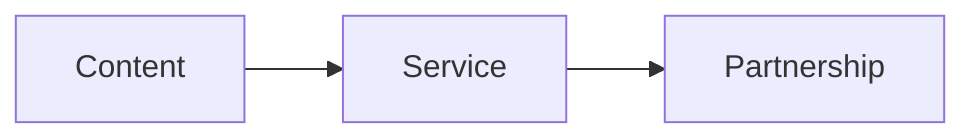
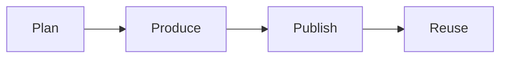
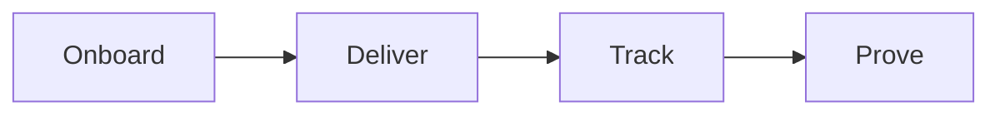
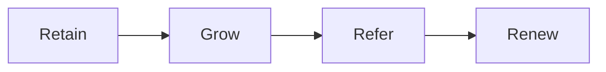

# Develop Audience

Develop Audience is the third step of the RED Method. Here we keep the audience
and the client growing. We run the content engine, deliver the product, and
build a long partnership.

## Content engine

We build an audience with content that lives inside the offer.

- We turn the nine steps of the offer into a content list.
- We plan, produce, publish, promote, and syndicate.
- We reuse one asset in many places.
- We build retargeting audiences from video views.

Every piece of content lives inside the signature solution. We never start from
a blank page, and we never post only once.

## Service

We deliver the product and create real results.

- We onboard you with a clear welcome and a kickoff.
- We set success goals and a start date.
- We deliver one module per week for 6 to 12 weeks.
- We teach on one day and coach on another.
- We track attendance, progress, and results.
- We collect a case study the moment results land.

You leave with client results, a case study, and a reference.

## Partnership

A one-time program is a project. A partnership is a relationship. We build the
relationship.

- We hold regular check-ins.
- We watch for clients who are quiet or stuck.
- We offer the next step at the right time.
- We build a community of clients.
- We ask happy clients for referrals.
- We renew and expand the work.

You get longer client life, more revenue per client, and advocates.

Next: [Results](results.md).
