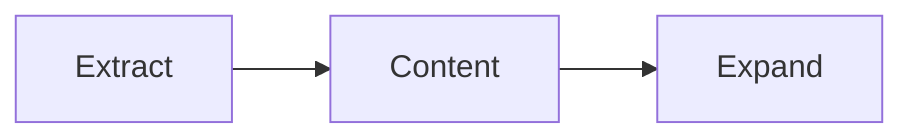
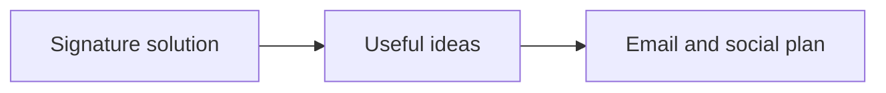
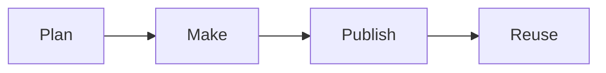
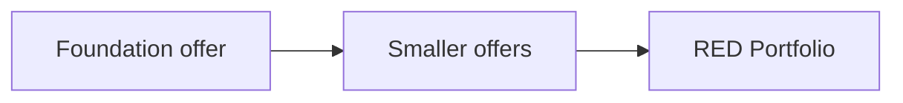
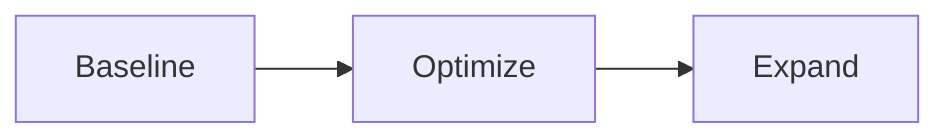
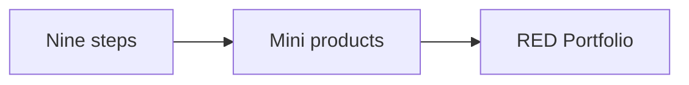
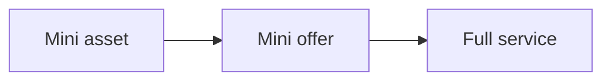

# Develop Audience

Develop Audience is one of the three phases of the RED Method. Here we keep
the audience and your RED Portfolio growing. The phase has three motions:
Extract, Content, and Expand. Each motion has three steps.

## The Extract motion

We take useful content from your signature solution and shape it into an email
and social plan.

1. **Pull out the key ideas.** We collect common questions, problems, steps in
the process, and praise or reviews.
2. **Group the ideas.** We sort them into clear themes that speak to your one
currency and the people you serve.
3. **Build the content plan.** We turn the themes into a plan for emails and
social posts.

## The Content motion

We make and share content from the plan.

1. **Make the content.** We turn the plan into clear posts, emails, and other
content.
2. **Publish it.** We share it on your site, by email, in chat, and on social
media. One asset can work in many places.
3. **Promote and reuse.** We share useful content again and build retargeting
audiences from video views.

We do not serve your customers. That work stays with you. We build the machine.
You run it with your customers.

## The Expand motion

We turn a working machine into a growing RED Portfolio.

We break the foundation offer into smaller offers that feed it. Each smaller
offer is a new entry point. It can win a new client, serve an existing one, or
raise customer lifetime value.

1. **Baseline the RED Portfolio.** The Client Engine is the first output of
   your engagement: the five stages of Build, Launch, Serve, Grow, and Partner.
   It is the first asset in your RED Portfolio. It is the baseline.
2. **Optimize what works.** We test and sharpen the assets that work.
3. **Expand the IP.** We turn assets into new offers and new revenue. Ongoing
   work raises the commercial value of the IP in your RED Portfolio.

### From steps to assets

The signature solution's nine steps can become more than lessons. Each step can
become its own small product.

- **Mini product**: a short course, tool, or workshop that solves one step.
- **Mini offer**: a paid audit, review, or done-for-you service for one step.
- **Mini asset**: a template, checklist, calculator, or video set for one step.

Each mini product speaks the one currency. Each one lands in the Asset
Portfolio. Each one keeps working after you build it.

Nothing stands alone. Each mini product, tool, or offer is an entry point and
an upgrade path to your full service.

- Each asset points to the next step.
- Each asset can promote the others.
- Each transition moves the client up to a higher ticket offer.

Over time, one signature solution becomes a family of products that support
each other. That family is the base of your ongoing partnership with us.

Next: [Results](results.md).
