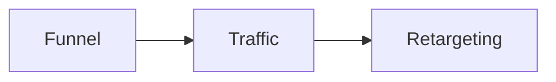
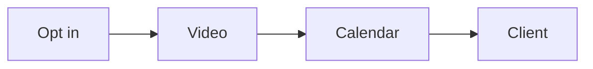
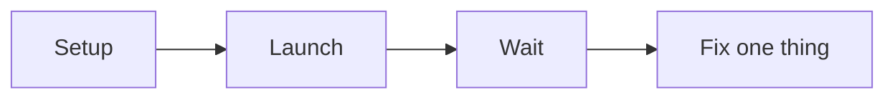
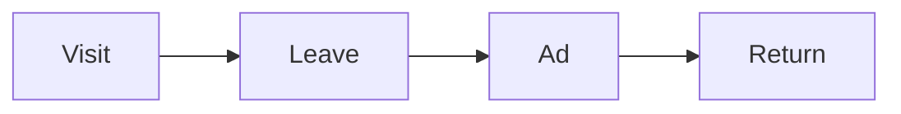

# Engage Opportunity

Engage Opportunity is the second step of the RED Method. Here we turn interest
into a paying client. We build the funnel, turn on traffic, and bring people
back.

## Funnel

We build the simple path that turns a stranger into a booked call.

- We make a short video that shows the signature solution.
- We use a six-part script: promise, proof, problems, steps, context, action.
- We build four pages: opt in, video, calendar, confirmation.
- We add branding, slides, recording, and editing.
- We add a homework video so people show up ready.

You leave with a live funnel and a finished authority video.

## Traffic

We turn on paid ads the right way.

- We set up tracking, audiences, and goals.
- We build a simple campaign: campaign, ad set, ad.
- We launch and then leave it alone for about 10 days.
- We watch a few key numbers.
- We change only one thing at a time.

You leave with a live ad campaign and a metrics dashboard.

## Retargeting

We bring back the people who got stuck.

- We add tracking and goals.
- We split audiences by where they stopped.
- We show a focused ad to each group.
- We measure and repeat.

You leave with a retargeting plan and a set of ads.

Next: [Develop Audience](develop-audience.md).
