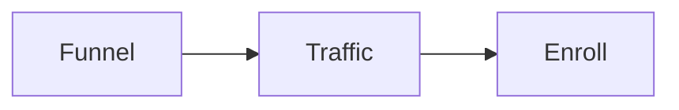
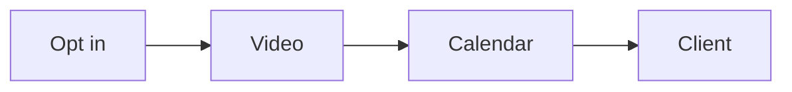
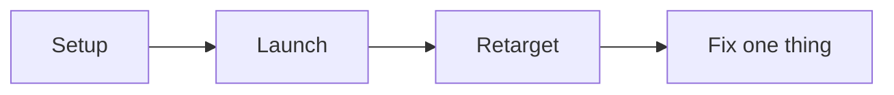
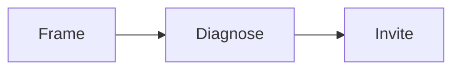
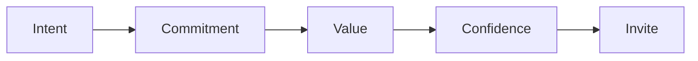
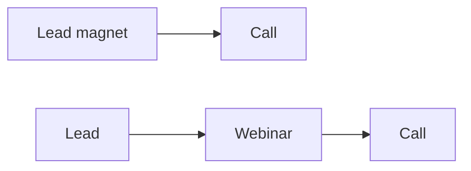

# Engage Opportunity

Engage Opportunity is one of the three phases of the RED Method. Here we turn
interest into a paying client. The phase has three motions: Funnel, Traffic, and Enroll.
Each motion has three steps.

## The Funnel motion

We build the simple path that turns a stranger into a booked call.

1. **Script the authority video.** We make a short video that shows the
   signature solution. We use a six-part script: promise, proof, problems,
   steps, context, action.
2. **Build the four pages.** We build four pages: opt in, video, calendar, and
   confirmation.
3. **Brand, record, edit.** We add branding, slides, recording, and editing. We
   add a homework video so people show up ready.

You leave with a live funnel and a finished authority video.

## The Traffic motion

We turn on paid ads the right way. We also bring back the people who got stuck.

1. **Set up tracking.** We set up tracking, audiences, and goals.
2. **Launch the campaign.** We build a simple campaign: campaign, ad set, ad.
   Then we launch and leave it alone for about 10 days.
3. **Retarget and tune one thing at a time.** We split audiences by where they
   stopped. We show a focused ad to each group. We watch a few key numbers and
   change only one thing at a time.

You leave with a live ad campaign, a retargeting plan, and a metrics dashboard.

## The Enroll motion

We run the enrollment call. We help a booked lead decide, with no pressure.

1. **Frame the call.** We set the time, the purpose, and the outcome. We ask why
   they booked and if they want help now. We check intent before we go on.
2. **Diagnose the gap.** We audit the lead against your product roadmap. We ask
   for exact numbers. We do not solve or pitch yet. We check commitment.
3. **Invite and handle objections.** We give a short plan. We answer doubts with
   questions, not pressure. Then we invite them to be the next client.

### The checkpoints

A checkpoint is a quick gate inside the call. The lead must pass it before you
move on. The gates are intent, commitment, value, confidence, and desire.

If a gate fails, we stop or step back. We do not push. A short, honest call is a
win. You leave with an enrollment script, a question set, and a checkpoint list.

We design and implement all of this for you. We write the words, the questions,
and the checkpoints. We practice the call with you until it feels natural, not
pushy.

## The enrollment evolution

We enroll clients in two phases. Phase 1 is a lead magnet to a call. Phase 2
adds a webinar: lead to webinar to call.

Build phase 1 first. Improve it until it works. Then add the webinar. The
webinar is a second enrollment mechanism. It teaches and sells at scale.

More: [The enrollment evolution](enrollment-evolution.md) and
[Develop Audience](develop-audience.md).
