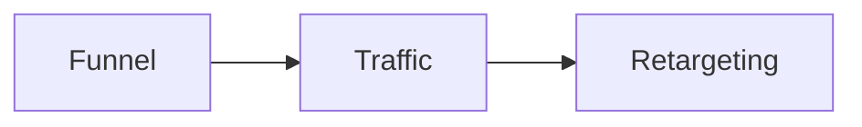
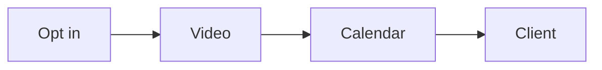
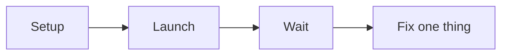
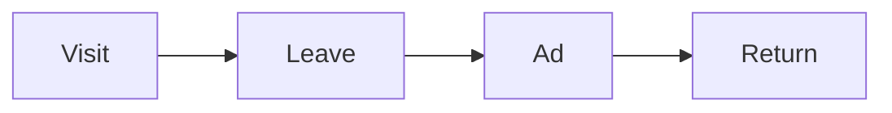

# Engage Opportunity

Engage Opportunity is the second phase of the RED Method. Here we turn interest
into a paying client. The phase has three motions: Funnel, Traffic, and
Retargeting. Each motion has three steps.

## Motion 4: Funnel

We build the simple path that turns a stranger into a booked call.

1. **Script the authority video.** We make a short video that shows the
   signature solution. We use a six-part script: promise, proof, problems,
   steps, context, action.
2. **Build the four pages.** We build four pages: opt in, video, calendar, and
   confirmation.
3. **Brand, record, edit.** We add branding, slides, recording, and editing. We
   add a homework video so people show up ready.

You leave with a live funnel and a finished authority video.

## Motion 5: Traffic

We turn on paid ads the right way.

1. **Set up tracking.** We set up tracking, audiences, and goals.
2. **Launch the campaign.** We build a simple campaign: campaign, ad set, ad.
   Then we launch and leave it alone for about 10 days.
3. **Tune one thing at a time.** We watch a few key numbers. We change only one
   thing at a time.

You leave with a live ad campaign and a metrics dashboard.

## Motion 6: Retargeting

We bring back the people who got stuck.

1. **Split audiences.** We add tracking and goals. We split audiences by where
   they stopped.
2. **Show focused ads.** We show a focused ad to each group.
3. **Measure and repeat.** We measure and repeat what works.

You leave with a retargeting plan and a set of ads.

Next: [Develop Audience](develop-audience.md).
