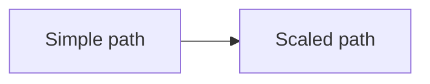
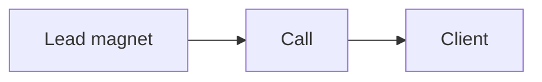
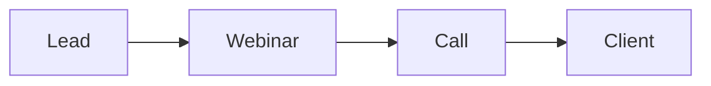

# The enrollment evolution

We enroll clients in two paths. Start simple. Then scale.

The simple path is a lead magnet to a call. The scaled path adds a webinar.

## The simple path: lead magnet to call

This is the first enrollment path. It is simple and fast.

- A lead magnet attracts the right person.
- A short video and a calendar page book the call.
- The call enrolls the client.

Build this first. Launch it. Improve it until it works.

## The scaled path: lead to webinar to call

Once the simple path works, add a webinar. The webinar is a second enrollment
mechanism.

- The webinar teaches and sells. It gives value first, then makes an offer.
- It warms many leads at once.
- It leads to a call, or a direct sale.

## Why the scaled path comes second

- The simple path proves the offer and the message.
- The scaled path grows what already works.
- A webinar on a weak offer wastes time. Fix the simple path first.

## The webinar as an enrollment mechanism

The webinar does the same job as the call. It helps a lead decide. It does it
at scale.

- It gives value first.
- It makes one clear offer.
- It moves the lead to a call.

## When to add the webinar

Add the scaled path when:

- The simple path books calls every week.
- The call closes at a steady rate.
- You want to reach more people at once.

Do not add the webinar before the simple path works.

## Where to go next

- [Engage Opportunity](engage-opportunity.md): funnel, traffic, enrollment.
- [Funnel playbook](../ops/playbooks/funnel.md): build the simple path.
- [Enroll playbook](../ops/playbooks/enroll.md): run the call.
