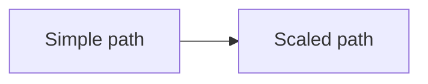
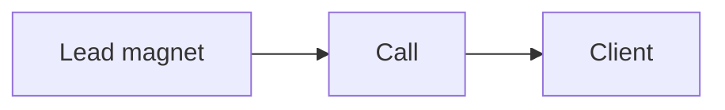
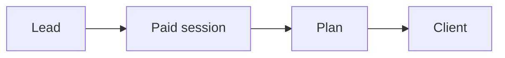
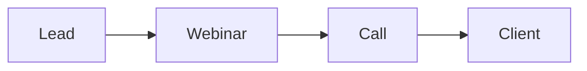
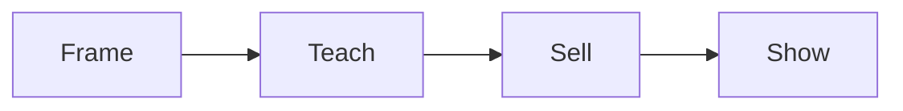
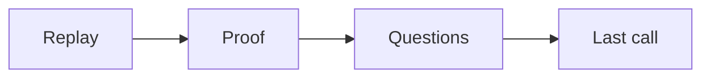

# The enrollment evolution

We enroll clients in two paths. Start simple. Then scale.

The simple path is a lead magnet to a call. The scaled path adds a webinar.

## The simple path: lead magnet to call

This is the first enrollment path. It is simple and fast.

- A lead magnet attracts the right person.
- A short video and a calendar page book the call.
- The call enrolls the client.

Build this first. Launch it. Improve it until it works.

## A third way: the paid session

For a premium offer, we can add a paid roadmap session. The lead pays a fee and
gets a plan for their next 90 days. The fee qualifies the lead and earns
revenue. If they join the program, we credit the fee to their first month.

## The scaled path: lead to webinar to call

Once the simple path works, add a webinar. The webinar is a second enrollment
mechanism.

- The webinar teaches and sells. It gives value first, then makes an offer.
- It warms many leads at once.
- It leads to a call, or a direct sale.

### The shape of a webinar

A webinar follows a fixed shape and a fixed clock. About 60 minutes.

- **Frame**: the promise, who it is for, and who it is not for.
- **Teach**: three short lessons, one per phase of your signature solution. We
  teach the what, not the how.
- **Shift**: two options, and a request to show the offer.
- **Sell**: a tour, a value stack, the price, and a guarantee.
- **Show**: welcome new clients and answer doubts as questions.

Most sales come after the webinar, in the closing sequence. It runs for a few
days.

## Why the scaled path comes second

- The simple path proves the offer and the message.
- The scaled path grows what already works.
- A webinar on a weak offer wastes time. Fix the simple path first.

## When to add the webinar

Add the scaled path when:

- The simple path books calls every week.
- The call closes at a steady rate.
- You want to reach more people at once.

We only automate a webinar after it has run live about ten times at a good
result. We never pretend an automated webinar is live.

## Where to go next

- [Engage Opportunity](engage-opportunity.md): funnel, traffic, enrollment.
- [Funnel playbook](../ops/playbooks/funnel.md): build the simple path.
- [Enroll playbook](../ops/playbooks/enroll.md): run the call.
- [Webinar playbook](../ops/playbooks/webinar.md): run the scaled path.
