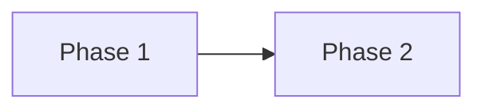
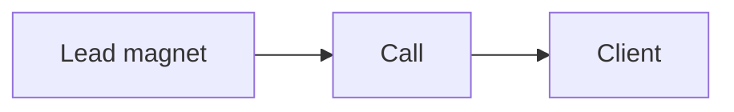
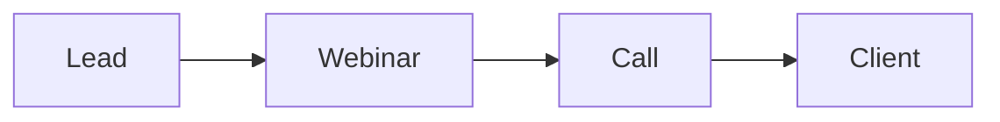

# The enrollment evolution

We enroll clients in two phases. Start with the simple path. Then evolve.

Phase 1 is a lead magnet to a call. Phase 2 adds a webinar.

## Phase 1: lead magnet to call

This is the first enrollment path. It is simple and fast.

- A lead magnet attracts the right person.
- A short video and a calendar page book the call.
- The call enrolls the client.

Build this first. Launch it. Improve it until it works.

## Phase 2: lead to webinar to call

Once phase 1 works, add a webinar. The webinar is a second enrollment
mechanism.

- The webinar teaches and sells. It gives value first, then makes an offer.
- It warms many leads at once.
- It leads to a call, or a direct sale.

## Why phase 2 comes second

- Phase 1 proves the offer and the message.
- Phase 2 scales what already works.
- A webinar on a weak offer wastes time. Fix phase 1 first.

## The webinar as an enrollment mechanism

The webinar does the same job as the call. It helps a lead decide. It does it
at scale.

- It gives value first.
- It makes one clear offer.
- It moves the lead to a call.

## When to add the webinar

Add phase 2 when:

- Phase 1 books calls every week.
- The call closes at a steady rate.
- You want to reach more people at once.

Do not add the webinar before phase 1 works.

## Where to go next

- [Engage Opportunity](engage-opportunity.md): funnel, traffic, enrollment.
- [Funnel playbook](../ops/playbooks/funnel.md): build phase 1.
- [Enroll playbook](../ops/playbooks/enroll.md): run the call.
