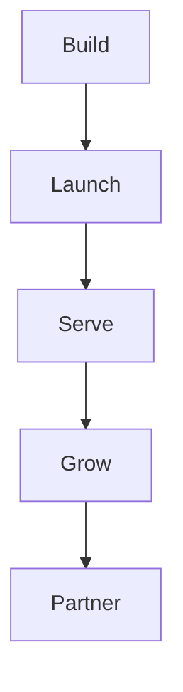
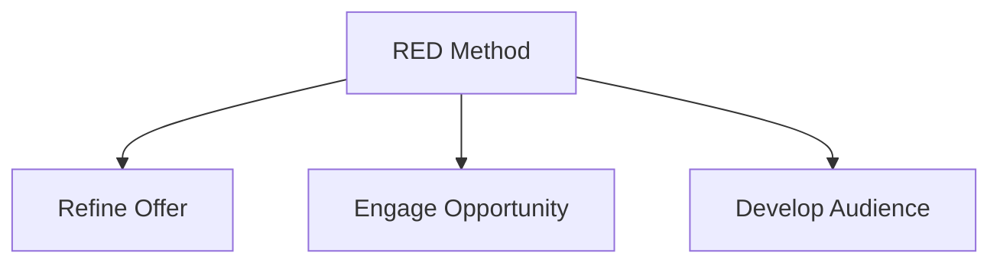

# The journey

The full journey has five motions. We lead you through all five, from first
build to lasting partnership.

- **Build**: make the offer, the message, and the funnel.
- **Launch**: turn on paid traffic and content.
- **Serve**: deliver the product and get results.
- **Grow**: add content, follow up, and referrals.
- **Partner**: keep them long term as the assets grow.

## How the motions map to RED

| RED step | Motions |
|---|---|
| Refine Offer | Build |
| Engage Opportunity | Launch |
| Develop Audience | Serve, Grow, Partner |

- **Refine Offer** makes the thing worth buying.
- **Engage Opportunity** turns interest into a client.
- **Develop Audience** keeps the audience and the client growing over time.

Next: [Refine Offer](refine-offer.md).
