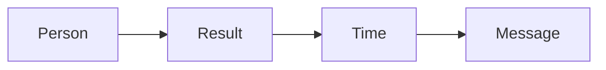
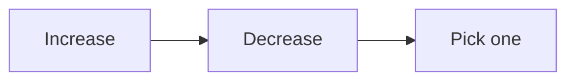
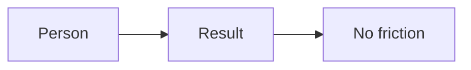
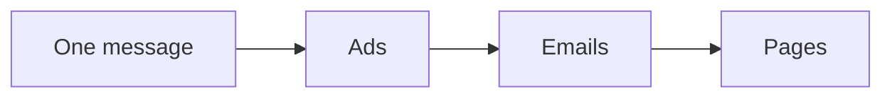

# The money message

The money message is one clear sentence about what you do. It names the person,
the result, and the time. It is built from your one currency.

## One currency first

A currency is the one measured result you sell. To find it, list two things:

- What you increase.
- What you decrease.

Then pick one. The best currency is the one the market already wants.

Some words are too cold to sell. Words like growth, impact, and authority do
not work. Use a measured result instead. For example: "10 new clients in 30
days," or "no more cravings in 30 days."

## The message formula

Use this shape:

> I help [person] get [result] in [time] without [friction].

## The filters

Run every message through these checks:

- Does it wake your buyer at 3 a.m.?
- Is it a painkiller, not a vitamin?
- Is it in the buyer's own words?
- Does it have a metric and a timeline?

If it fails a check, fix it and try again. Expect a few passes before it lands.

## Keep it as the master

The message is a master template. Do not use it word for word everywhere. Take
pieces of it for ads, emails, subjects, and the booking page. Every step of
your offer can have its own small message.

## How we help

We build the currency list with you. We write the message, run the filters, and
keep working until it is right. This is the hardest part of the method, and we
do not move on until it is clear.

Next: [The product roadmap](product-roadmap.md).
