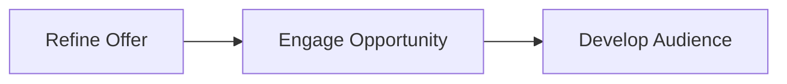
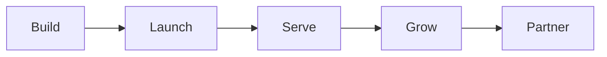
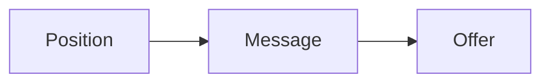
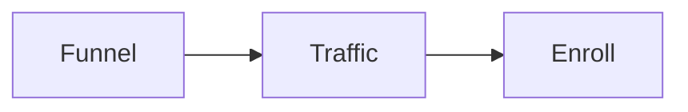
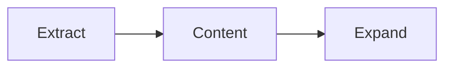

# The method map

The RED Method has three phases. Each phase has three motions. Each motion has
three steps. That makes 27 steps in total.

- **Phase**: one of the three parts of the method.
- **Motion**: a group of activities inside a phase. There are nine motions.
- **Step**: one action inside a motion. There are 27 steps.
- **Stage**: how the work shows up over time: Build, Launch, Serve, Grow,
  Partner. The stages are how the motions get materialized.

- **Build** happens in Refine Offer. We build the Client Engine in this stage.
- **Launch** happens mostly in Engage Opportunity.
- **Serve** is yours. You serve your customers with the new model and offer.
- **Grow** happens in the Expand motion. Smaller offers feed the foundation
  offer. This grows the RED Portfolio.
- **Partner** keeps the results growing for years.

The Client Engine is the first output of the engagement: the five stages of
Build, Launch, Serve, Grow, and Partner, materialized as the first asset in
your RED Portfolio.

## Refine Offer

We make something worth buying.

| Motion | Step 1 | Step 2 | Step 3 |
|---|---|---|---|
| Position | Set goals and numbers | Size the market | Pick one market and avatar |
| Message | List every result | Pick one currency | Write one message |
| Offer | Build the profit pyramid | Design the signature solution | Package and price |

## Engage Opportunity

We turn interest into a paying client.

| Motion | Step 1 | Step 2 | Step 3 |
|---|---|---|---|
| Funnel | Script the authority video | Build the four pages | Brand, record, edit |
| Traffic | Set up tracking | Launch the campaign | Retarget and tune one thing at a time |
| Enroll | Frame the call | Diagnose the gap | Invite and handle objections |

Enrollment evolves in two phases. Phase 1 is a lead magnet to a call. Phase 2
adds a webinar: lead to webinar to call. See
[the enrollment evolution](enrollment-evolution.md).

## Develop Audience

We keep the audience and the RED Portfolio growing.

| Motion | Step 1 | Step 2 | Step 3 |
|---|---|---|---|
| Extract | Pull key ideas from the signature solution | Group themes around the one currency | Build an email and social plan |
| Content | Make posts and emails from the plan | Publish across channels | Promote and reuse |
| Expand | Baseline the RED Portfolio | Optimize what works | Expand the IP |

## Where to go next

- [Refine Offer](refine-offer.md): the three motions of Refine Offer.
- [Engage Opportunity](engage-opportunity.md): the three motions of Engage Opportunity.
- [Develop Audience](develop-audience.md): the three motions of Develop Audience.
