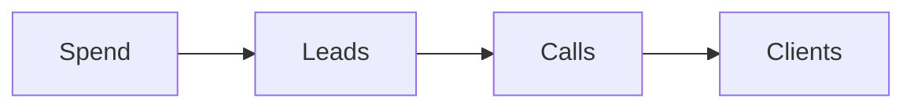
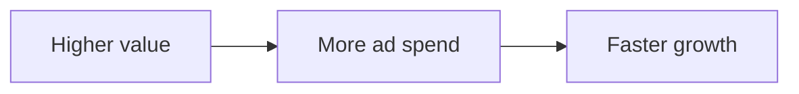
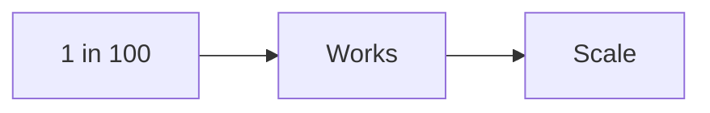
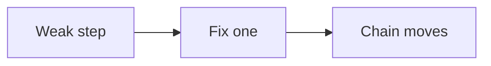
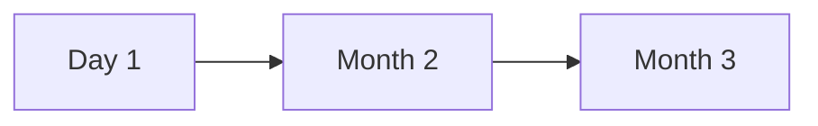

# How the numbers work

The method runs on a few simple numbers. You do not need many. You need the
right ones, written down.

## The master number

The master number is the lifetime value of a client. It is what one client is
worth over time. When it goes up, every part of the business gets easier.

## The 1% rule

Plan for about one lead in one hundred to buy. If the business works at that
rate, it works at any higher rate. This one rule carries a lot of weight.

## The chain

Every step has one number.

- Cost per lead.
- Leads that book a call.
- Calls that enroll.
- Cost per client.

When one step is weak, the whole chain slows down. We find the weak step and
fix that one first.

## Target numbers

These are examples from our work. Use them as targets, not promises.

- A premium offer starts at $3,000 or more.
- The cost per lead is about $10 to start.
- About 3 to 5% of leads book a call.
- About 20 to 40% of calls enroll.
- About 1 lead in 100 buys.

## Why follow-up matters

A lead is worth a little on day one and more over time. Most leads buy later.
This is why we keep the nurture running and why we do not judge a lead too
early.

## A note on the numbers

Numbers in this method are targets, not promises. Your results will depend on
your market, your offer, and your work. We use the numbers to plan and to spot
a weak step, and we change one thing at a time.

Next: [Results](results.md).
