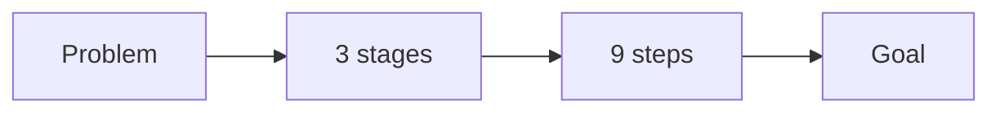
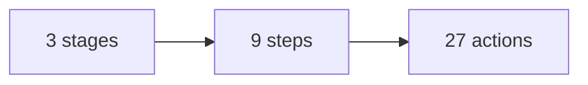
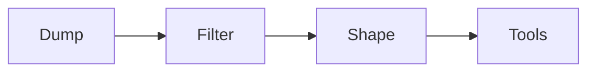
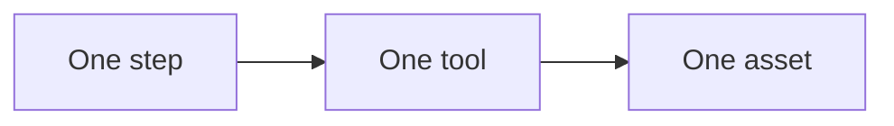
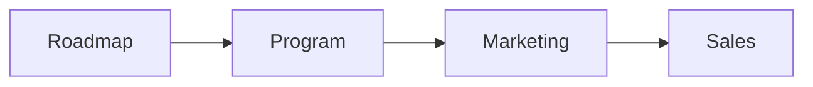

# The product roadmap

The product roadmap is the map of your offer. It shows the path a buyer takes
from their problem to their goal. It has three stages and nine steps.

## The shape

The roadmap always uses the same simple shape: three stages, nine steps, and
twenty-seven actions.

This shape fits any subject. It keeps the offer clear and easy to follow.

## How we build it

1. **Brain dump.** We list every step, topic, and question the buyer faces
   between their problem and their goal.
2. **Filter.** We cut anything that is not essential. If a step is removed and
   the result still stands, the step is not needed.
3. **Shape.** We group the rest into three stages and nine steps.
4. **Tools.** Every step gives the buyer one working tool, not just words. A
   checklist, a template, or a short lesson.

## Why every step needs a tool

Words alone are easy to forget. A tool gives the buyer a win. It also becomes a
lead magnet, a lesson, and a piece of content. This is how one product becomes
many.

## One map, many uses

The same nine steps run everything:

- The program and its modules.
- The webinar and its lessons.
- The emails and the ads.
- The enrollment call and its questions.

## How we help

We run the brain dump with you. We filter the list and shape it into the nine
steps. We design one tool for each step. Then everything else in the method
builds on this one map.

Next: [How the numbers work](numbers.md).
