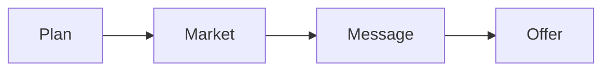
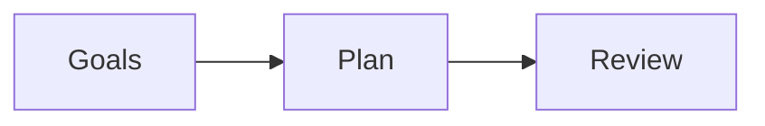
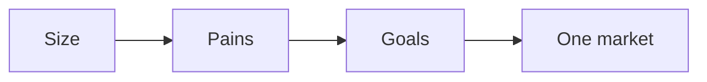
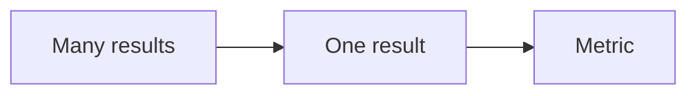
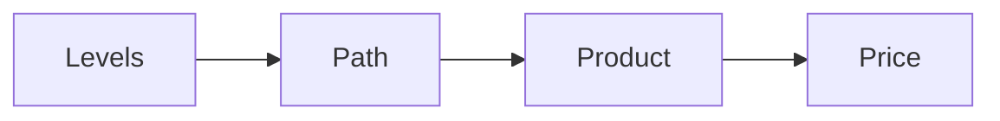

# Refine Offer

Refine Offer is the first step of the RED Method. Here we make something worth
buying. We set the numbers, pick the market, sharpen the message, and build the
offer.

## Plan

We agree on the numbers and the plan.

- We write a simple one-page plan.
- We set goals for revenue and clients.
- We learn the key numbers: cost per lead, cost per session, cost per client,
  and the value of a client.
- We review the plan every 90 days.

The plan is specific and measurable. It does not sit on a shelf.

## Market and avatar

We find the one market you can reach and serve.

- We size the market on social and business networks.
- We study the top pains, goals, and fears of the buyer.
- We check the market has profit, presence, and a path to reach people.
- We narrow many possible markets down to one.

The market is big enough, reachable, and has a problem worth solving.

## Message

We turn a category into one clear message.

- We list every result you could sell.
- We pick the one result that is critical and specific.
- We give it a metric and a timeline.
- We name the three main obstacles the buyer faces.
- We write one message that ties the person, the result, and the time together.

The message has one currency, a metric, and a timeline. This is the hardest step
in the whole line, and we do not move on until it is right.

## Offer and price

We package the work into a product with a price.

- We split the market into four levels by success.
- We choose which levels you serve and which you do not.
- We build a visual path from the buyer's pain to the goal.
- We choose how you deliver: group program, one-to-one, or done for you.
- We set a premium price.
- We outline a program of 6 to 12 weeks, one module per week.

You leave with a profit pyramid, a signature solution, a product outline, and a
price.

Next: [Engage Opportunity](engage-opportunity.md).
