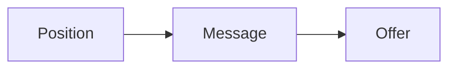
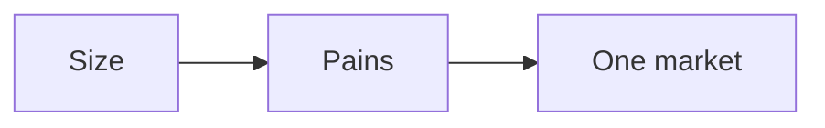
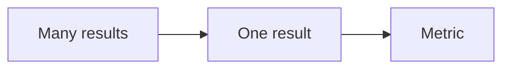
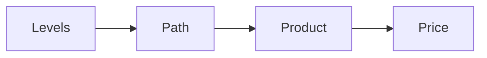

# Refine Offer

Refine Offer is one of the three phases of the RED Method. Here we make
something worth buying. The phase has three motions: Position, Message, and Offer. Each motion
has three steps.

## The Position motion

We set the course before we build.

1. **Set goals and numbers.** We write a simple one-page plan. We set goals for
   revenue and clients. We learn the key numbers: cost per lead, cost per
   session, cost per client, and the value of a client.
2. **Size the market.** We measure the market on social and business networks.
   We study the top pains, goals, and fears of the buyer.
3. **Pick one market and avatar.** We check the market has profit, presence,
   and a path to reach people. Then we narrow many possible markets down to
   one.

The plan is specific and measurable. It gets reviewed on a schedule. It does
not sit on a shelf.

## The Message motion

We turn a category into one clear message.

1. **List every result.** We list every result you could sell. We use a two
   column tool: what you increase and what you decrease. This is the currency
   calculator.
2. **Pick one currency.** We pick the one result that is critical and specific.
   We give it a metric and a timeline.
3. **Write one message.** We name the three main obstacles the buyer faces.
   Then we write one message that ties the person, the result, and the time
   together.

The message has one currency, a metric, and a timeline. This is the hardest
work in the whole engagement, and we do not move on until it is right. See
[the money message](money-message.md).

## The Offer motion

We package the work into a product with a price.

1. **Build the profit pyramid.** We split the market into four levels by
   success. We choose which levels you serve and which you do not.
2. **Design the signature solution.** We build a visual path from the buyer's
   pain to the goal. The path has three phases and nine steps.
3. **Package and price.** We choose how you deliver: group program,
   one-to-one, or done for you. We set a premium price and outline the program.

Before we design anything, we run a digital brain dump. We list every step the
buyer must take. Then we filter the list down to the nine steps that matter.
Every step gets one working tool, not just words. See
[the product roadmap](product-roadmap.md).

## What good looks like

- A strong offer solves one problem, in one order, for one price.
- The offer is a painkiller, not a vitamin.
- The price starts at a premium level, and we never discount it. We shorten
  the path or offer a payment plan instead.

You leave this phase with a profit pyramid, a signature solution, a product
roadmap, a product outline, and a price.

More: [Engage Opportunity](engage-opportunity.md) and
[how the numbers work](numbers.md).
