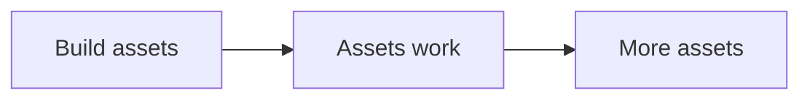
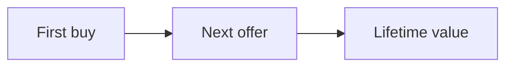
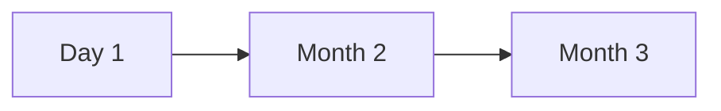
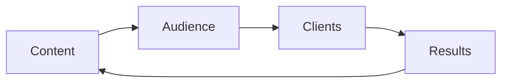

# Results

An asset is something that keeps working after you build it. The RED Method
creates many assets. Over time they stack up. That is the RED Portfolio.

Assets in the RED Portfolio are licensed to you for use under your agreement
with us.

Here is each asset and how it grows.

| Asset | Where it comes from | How it grows | What we do with it |
|---|---|---|---|
| One currency | Message work | It sharpens with each test | It guides every message |
| Signature solution | Offer work | It collects examples and proof | It organizes the program |
| Product roadmap | Offer work | It gains a tool per step | It runs the program |
| Client Engine | Build and launch | Each motion feeds the next | It runs the system |
| Program content | Offer work | One module at a time | It is the product |
| Funnel | Funnel work | Small tests improve it | It books calls |
| Authority video | Funnel work | New versions over time | It warms cold leads |
| Lead magnets | Content work | One per step of the offer | They bring leads |
| Enrollment script | Enroll work | Each call makes it sharper | It turns calls into clients |
| Audience | Traffic and content | Lists only get bigger | It is the fuel |
| Content library | Content work | One asset becomes many | It brings leads for years |
| Retargeting lists | Ads and content | They keep filling | They recover lost leads |
| Results and stories | Your delivery | Each result adds proof | They build trust |
| Reputation | All of the above | It compounds | It lowers ad cost |

## The value of one client

The master number is the lifetime value of a client. It is what one client is
worth over time. When it goes up, you can spend more to win the next one.

A single client can also grow. A small first purchase can lead to a bigger one
later.

## A lead grows with age

A lead is worth a little when it arrives. It is often worth more after a few
months of follow-up. This is why we keep the nurture running. Most leads buy
later, not on day one.

## The compounding loop

Each turn of the loop makes the next turn stronger.

One real result becomes a story. A story becomes content. Content brings an
audience. The audience brings clients. The loop repeats. Each pass is worth
more than the last.

## A note on the numbers

Numbers in this method are targets, not promises. Your results will depend on
your market, your offer, and your work. See [how the numbers work](numbers.md).
