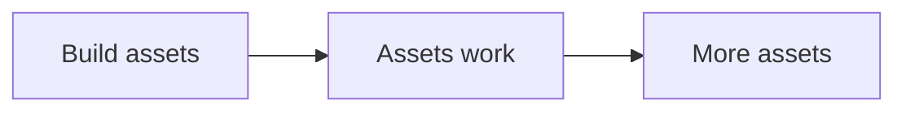
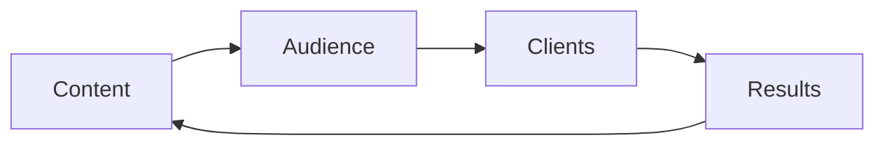

# Results

An asset is something that keeps working after you build it. The RED Method
creates many assets. Over time they stack up. That is the portfolio.

Here is each asset and how it grows.

| Asset | Where it comes from | How it grows | What we do with it |
|---|---|---|---|
| One currency | Message work | It sharpens with each test | It guides every message |
| Signature solution | Offer work | It collects examples and proof | It organizes the program |
| Client Engine | Build and launch | Each motion feeds the next | It runs the system |
| Program content | Offer work | One module at a time | It is the product |
| Funnel | Funnel work | Small tests improve it | It wins clients |
| Authority video | Funnel work | New versions over time | It warms cold leads |
| Audience | Traffic and content | Lists only get bigger | It is the fuel |
| Content library | Content work | One asset becomes many | It brings leads for years |
| Retargeting lists | Ads and content | They keep filling | They recover lost leads |
| Results and stories | Your delivery | Each result adds proof | They build trust |
| Reputation | All of the above | It compounds | It lowers ad cost |

## The compounding loop

Each turn of the loop makes the next turn stronger.

One real result becomes a story. A story becomes content. Content brings an
audience. The audience brings clients. The loop repeats. Each pass is worth
more than the last.
