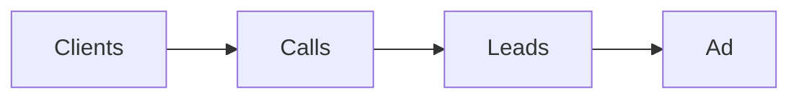

# Ad fix checklist

Run this list when an ad is not working.

Work down the chain. Fix the top first.

## Before you start
- [ ] Get the funnel math.
- [ ] Get the current campaign numbers.
- [ ] Keep your calm. Use numbers, not feelings.

## Steps
- [ ] Check the client count. If low, check the call and the offer.
- [ ] Check the booked call count. If low, check the funnel pages.
- [ ] Check the lead count. If low, check the ad and the audience.
- [ ] Check the learning phase. Wait for about 25 to 45 conversions.
- [ ] Check the click rate. Aim for a few percent.
- [ ] Check the opt-in rate. Aim for 30% or more.
- [ ] Check the show rate. Aim for 70% or more.
- [ ] Change one thing only.
- [ ] Test at the top of the funnel first.
- [ ] Wait about 10 days before judging a new campaign.
- [ ] Do not lower the price to fix the ads.

## Done when
- [ ] The weak step is named.
- [ ] One change is made and tested.
- [ ] The numbers are written down.
