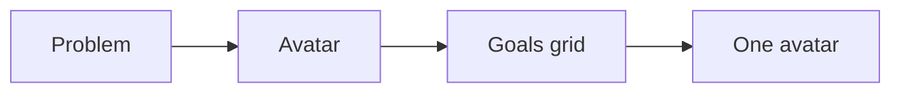

# Avatar ecosystem checklist

Run this list to build the avatar snapshot and the goals grid.

The research starts from the problem, not the person.

## Before you start
- [ ] Get the one currency.
- [ ] Get access to social and business networks.
- [ ] Read the [market playbook](../playbooks/market.md).

## Steps
- [ ] Size the market on social networks.
- [ ] Size the market on business networks.
- [ ] List the top pains of the buyer.
- [ ] List the top goals of the buyer.
- [ ] List the top fears of the buyer.
- [ ] Read the top books, courses, and reviews in the market.
- [ ] List where the buyer spends time.
- [ ] Check the market has profit, presence, and reach.
- [ ] Narrow to one market.
- [ ] Pick one avatar for the first step.
- [ ] Fill in the goals grid.
- [ ] Ask the market one question about the first problem.

## Done when
- [ ] The market is big, reachable, and worth serving.
- [ ] One avatar is chosen for the first step.
- [ ] The goals grid is filled in.
