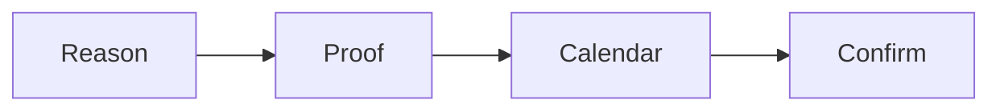

# Booking page checklist

Run this list to build the page where a lead books a call.

The page resells the decision before the call.

## Before you start
- [ ] Get the one currency and message.
- [ ] Get the calendar tool.
- [ ] Read the [funnel playbook](../playbooks/funnel.md).

## Steps
- [ ] Write the reason to book at the top.
- [ ] Add one line of proof.
- [ ] Restate the one currency and message.
- [ ] Embed the calendar on the page.
- [ ] Offer a 72-hour window. Ideal is 24 to 48 hours.
- [ ] Add your booking rules.
- [ ] Add a short confirmation.
- [ ] Add a pre-call homework page.
- [ ] Send three or four confirmations.
- [ ] Test the page on a phone.
- [ ] Check every link works.

## Done when
- [ ] The page resells the decision.
- [ ] The calendar is embedded.
- [ ] The 72-hour window is set.
- [ ] The homework page is ready.
