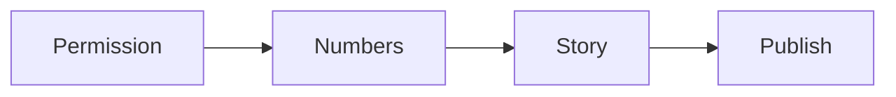

# Case study checklist

Run this list the moment a client gets a result.

The capture moves from permission to publish.

## Before you start
- [ ] Confirm the result is real and measured.
- [ ] Pick the client and the result.
- [ ] Find a quiet time to talk.

## Steps
- [ ] Ask the client for permission to share.
- [ ] Say where we will use the story.
- [ ] Collect the starting numbers.
- [ ] Collect the ending numbers.
- [ ] Ask what changed and how.
- [ ] Ask for one quote in the client's own words.
- [ ] Write the story in plain words.
- [ ] Send the draft to the client to check.
- [ ] Fix anything the client flags.
- [ ] Publish the case study.
- [ ] Add it to the [reputation track](reputation-track.md).

## Done when
- [ ] We have written permission.
- [ ] The numbers are clear and true.
- [ ] The story is short and plain.
- [ ] The quote is approved.
- [ ] The case study is live.
