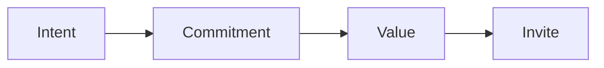

# Checkpoint card checklist

Run this list on every enrollment call. Pass each gate before you move on.

The call has five gates. Here is the main flow.

## Before you start
- [ ] Read the client's one currency.
- [ ] Read the [product roadmap](product-roadmap.md).
- [ ] Have the question set ready.
- [ ] Set a quiet place for the call.

## Steps
- [ ] Frame the call: time, purpose, and outcome.
- [ ] Check intent. Does the lead want to solve this now?
- [ ] Stop early if intent is low.
- [ ] Audit the gap. Ask for exact current numbers.
- [ ] Ask for the goal numbers.
- [ ] Check commitment. Get a 5 before you prescribe.
- [ ] Check value. Does the lead see the worth?
- [ ] Check confidence. Does the lead believe they can do it?
- [ ] Check desire. Does the lead want it now?
- [ ] Give a short plan.
- [ ] Invite with no pressure.
- [ ] Answer objections with questions.
- [ ] Note where the call ended.

## Done when
- [ ] Every gate passed before the invite.
- [ ] The lead gave a clear yes or a clear no.
- [ ] The call ended with a next step.
- [ ] The end point is noted.
