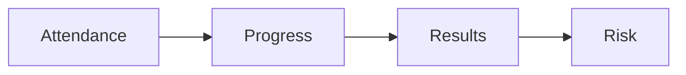

# Client scorecard checklist

Run this list each week to track one client.

The scorecard watches four things.

## Before you start
- [ ] Open the client scorecard.
- [ ] Pull the session notes from the week.
- [ ] Pull the current numbers.

## Steps
- [ ] Mark who came to each session.
- [ ] Note the modules the client finished.
- [ ] Note the tasks the client did.
- [ ] Record the result numbers.
- [ ] Compare the numbers to the goals.
- [ ] Mark any risk: quiet, stuck, or behind.
- [ ] Write one action for the next week.
- [ ] Share the scorecard with the delivery lead.

## Done when
- [ ] Attendance is marked.
- [ ] Progress is noted.
- [ ] Results are compared to the goals.
- [ ] Risks have an action.
- [ ] The scorecard is shared.
