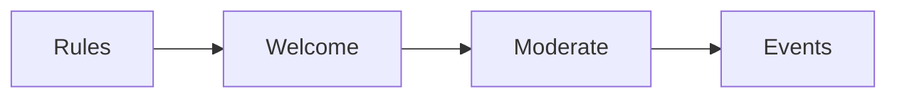

# Community rules checklist

Run this list to start and run the client community.

The work has four parts.

## Before you start
- [ ] Pick the place for the community.
- [ ] Write the rules in plain words.
- [ ] Pick the people who will help run it.
- [ ] Set a welcome message.

## Steps
- [ ] Post the rules where everyone can see them.
- [ ] Welcome each new member by name.
- [ ] Ask one easy question to start a talk.
- [ ] Watch the posts each day.
- [ ] Remove spam and mean posts fast.
- [ ] Warn a member before you remove them.
- [ ] Run one event each month.
- [ ] Share wins from the group.

## Done when
- [ ] The rules are posted.
- [ ] Every new member is welcomed.
- [ ] The group is safe and active.
- [ ] The next event is set.
