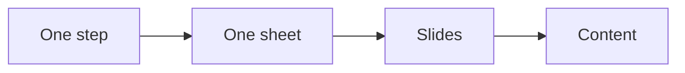

# Content crusher checklist

Run this list to fill one content crusher for one step of the offer.

One sheet turns one step into teachable slides.

## Before you start
- [ ] Get the [product roadmap](product-roadmap.md).
- [ ] Pick the step to teach.
- [ ] Read the [content playbook](../playbooks/content.md).

## Steps
- [ ] Write the topic and title.
- [ ] Write the promise with a metric and a timeline.
- [ ] Name the top three frustrations.
- [ ] Write the goal the buyer wants.
- [ ] Pick one image or metaphor.
- [ ] Name the deliverable for this step.
- [ ] Write the three how-to actions.
- [ ] Add one example or proof.
- [ ] Write one decision point.
- [ ] Write one action for the buyer.
- [ ] Check the sheet lives inside the offer.

## Done when
- [ ] Every field on the sheet is filled.
- [ ] The step has a deliverable.
- [ ] The sheet can become slides.
