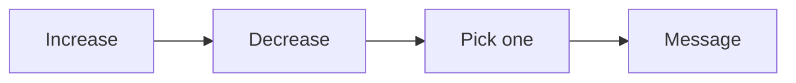

# Currency calculator checklist

Run this list to pick the one currency the offer will sell.

The two columns become one currency.

## Before you start
- [ ] Get every result the client could sell.
- [ ] Have notes on the buyer's pains, goals, and fears.
- [ ] Read the [message playbook](../playbooks/message.md).

## Steps
- [ ] List what the offer increases.
- [ ] List what the offer decreases.
- [ ] Pull ideas from client talk, books, courses, and search.
- [ ] Remove cold words like growth, impact, and authority.
- [ ] Mark the hot ideas: money, health, love, and business results.
- [ ] Ask the market: which problem should be solved first?
- [ ] Pick one currency.
- [ ] Give it a metric.
- [ ] Give it a timeline.
- [ ] Run the 3 a.m. test on it.
- [ ] Check it is a painkiller, not a vitamin.
- [ ] Write it in the buyer's own words.

## Done when
- [ ] One currency is chosen.
- [ ] It has a metric and a timeline.
- [ ] It passes the filters.
- [ ] It is approved before moving on.
