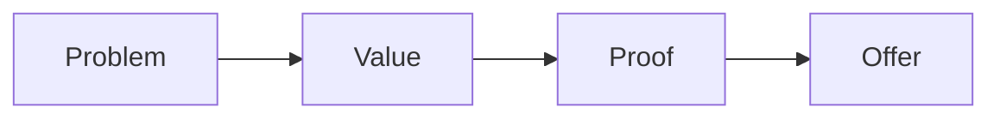

# Email sequence checklist

Run this list to build one email sequence for one funnel step.

The sequence keeps value high and promotion low.

## Before you start
- [ ] Get the nine steps of the offer.
- [ ] Get the one currency and message.
- [ ] Read the [nurture playbook](../playbooks/email-nurture.md).

## Steps
- [ ] Pick a funnel step and a goal.
- [ ] Write a value email for that step.
- [ ] Write a problem email for that step.
- [ ] Write an offer email for that step.
- [ ] Use the five types: Problem, Promise, Proof, Ping, Promotion.
- [ ] Add one clear action to every email.
- [ ] Keep promotion to about one in five.
- [ ] Build the full 27-part sequence.
- [ ] Reuse your slides as emails.
- [ ] Schedule the sends.
- [ ] Send the sequence until the lead acts.
- [ ] Review open and click rates each week.

## Done when
- [ ] The sequence covers the nine steps.
- [ ] Every email has one action.
- [ ] The promotion cap holds.
- [ ] The sequence runs on its own.
