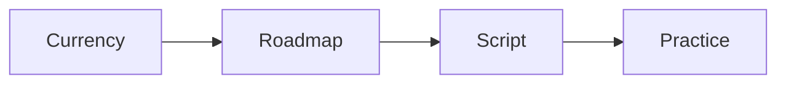

# Enrollment script checklist

Run this list to build the sales script for a client.

The script ties one currency to the roadmap.

## Before you start
- [ ] Get the client's one currency.
- [ ] Get the product roadmap.
- [ ] Get the current numbers and the goal numbers.
- [ ] Read the checkpoint card.

## Steps
- [ ] Write the six parts: promise, proof, problems, steps, context, action.
- [ ] Tie each part to the one currency.
- [ ] Write the question set for the gap audit.
- [ ] Set the checkpoints: intent, commitment, value, confidence, desire.
- [ ] Write the invite in plain words.
- [ ] Write answers to the common objections.
- [ ] Read the script out loud.
- [ ] Cut any hype or pressure.
- [ ] Practice with the client and the team.
- [ ] Note where each practice call ends.
- [ ] Fix the weak parts and practice again.

## Done when
- [ ] The script has all six parts.
- [ ] The one currency runs through the script.
- [ ] The checkpoints are in order.
- [ ] The objections have answers.
- [ ] The team can run it without pressure.
