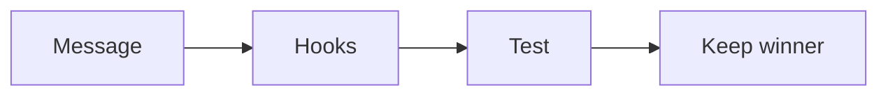

# Hooks and headlines checklist

Run this list to make many hooks from one message.

One body can carry many openings.

## Before you start
- [ ] Get the one currency and message.
- [ ] Get the authority video body.
- [ ] Read the [message playbook](../playbooks/message.md).

## Steps
- [ ] Write the base message.
- [ ] Write a hook about the good without the bad.
- [ ] Write a hook about something new.
- [ ] Write a hook that starts with "what if".
- [ ] Write a hook that shares a secret.
- [ ] Write a hook that names a common enemy.
- [ ] Write a hook that shows a transformation.
- [ ] Write a hook that promises a result.
- [ ] Swap each hook onto the same body.
- [ ] Test two ads in one ad set.
- [ ] Keep the winner and write a new rival.

## Done when
- [ ] Several hooks share one body.
- [ ] The hooks use the one currency.
- [ ] The winner is chosen by the numbers.
