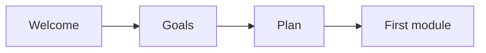

# Kickoff checklist

Run this list when a new client signs and you start the work.

Here is the flow from welcome to the first module.

## Before you start
- [ ] Confirm the client signed the agreement.
- [ ] Name the delivery lead for this client.
- [ ] Book the kickoff call.
- [ ] Open a shared folder for the client.

## Steps
- [ ] Send a welcome note within one business day.
- [ ] Say who we are and what happens next.
- [ ] Set success goals with the client.
- [ ] Write each goal as a number and a date.
- [ ] Agree on the start date.
- [ ] Collect access: ad account, calendar, email, and site.
- [ ] Write the one-page plan.
- [ ] Review the plan with the client.
- [ ] Schedule the first module.
- [ ] Send the client the plan and the dates.

## Done when
- [ ] The client has a welcome note and a named lead.
- [ ] Success goals are written and agreed.
- [ ] The start date is set.
- [ ] We have the access we need.
- [ ] The one-page plan is shared.
- [ ] The first module is on the calendar.
