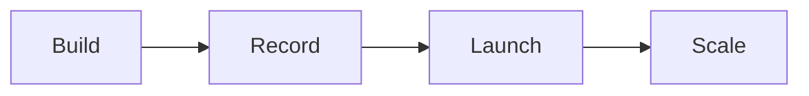

# Launch calendar checklist

Run this list to plan a launch in about 14 days.

One assignment per day.

## Before you start
- [ ] Finish the one currency and message.
- [ ] Book the launch dates.
- [ ] Read the [offer](../playbooks/offer.md) and [funnel playbooks](../playbooks/funnel.md).

## Steps
- [ ] Day 1: confirm the currency.
- [ ] Day 2: confirm the avatar.
- [ ] Day 3: write the message.
- [ ] Day 4: run the digital brain dump.
- [ ] Day 5: build the [product roadmap](product-roadmap.md).
- [ ] Day 6: write the course outline.
- [ ] Day 7: fill the content crushers.
- [ ] Day 8: finish the crushers and set the price.
- [ ] Day 9: build the slide deck.
- [ ] Day 10: set the price and the payment plan.
- [ ] Day 11: finish the slides and the deliverables.
- [ ] Day 12: build the production plan.
- [ ] Day 13: record and edit the modules.
- [ ] Day 14: publish and turn the funnel on.

## Done when
- [ ] Every step has a deliverable.
- [ ] The modules are recorded.
- [ ] The funnel is live.
- [ ] The first ads are running.
