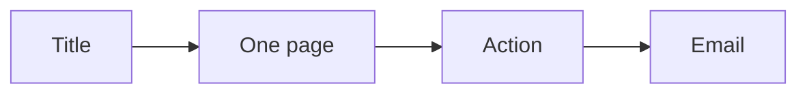

# Lead magnet PDF checklist

Run this list to build the short PDF that pairs with the authority video.

The PDF is one page wrapped in a short cover.

## Before you start
- [ ] Pick one hot step of the offer.
- [ ] Get the one currency and message.
- [ ] Read the lead magnet playbook.

## Steps
- [ ] Write the title for the person and the result.
- [ ] Add a short line of proof.
- [ ] Add a short bio.
- [ ] Name the problem.
- [ ] Write the one-page cheat sheet.
- [ ] List the steps in plain words.
- [ ] Add one clear next action.
- [ ] Use a picture of the thing itself.
- [ ] Keep it to about ten minutes to use.
- [ ] Leave one step for the call.
- [ ] Test two titles and keep the winner.
- [ ] Set the PDF to send by email.

## Done when
- [ ] The PDF solves one small problem.
- [ ] It is one page plus a cover.
- [ ] It has one clear action.
- [ ] It sends by email, not by a thank-you page.
