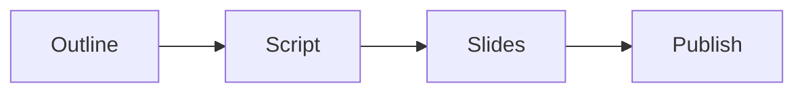

# Module production checklist

Run this list to build one module of the program.

The build moves from outline to publish.

## Before you start
- [ ] Know the module goal and the one currency.
- [ ] Check the module fits the signature solution.
- [ ] Block time to write and record.

## Steps
- [ ] Write the outline. One idea per section.
- [ ] Write the script in plain words.
- [ ] Read the script out loud and fix rough spots.
- [ ] Build the slides from the script.
- [ ] Add the brand images and colors.
- [ ] Record the module.
- [ ] Edit the recording.
- [ ] Review the module against the goal.
- [ ] Fix anything that is unclear.
- [ ] Publish the module to the client space.
- [ ] Send the client the link and the task.

## Done when
- [ ] The module meets its goal.
- [ ] The script and slides match.
- [ ] The video is clear and on brand.
- [ ] The module is live for the client.
- [ ] The client has the link and the task.
