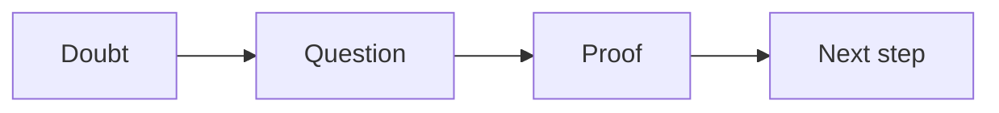

# Objection sheet checklist

Run this list when a lead raises a doubt on a call.

Here is the loop you follow for each doubt.

## Before you start
- [ ] Know the one currency for this offer.
- [ ] Have the common doubts list ready.
- [ ] Have one proof point for each doubt.
- [ ] Set a quiet place to listen.

## Steps
- [ ] Let the lead finish. Do not talk over them.
- [ ] Name the doubt in one short sentence.
- [ ] Ask a question to learn more.
- [ ] Listen for the real worry.
- [ ] Give one proof point. Use a fact or a story.
- [ ] Check that the lead feels heard.
- [ ] Agree on the next step.
- [ ] Write down the doubt and the answer.

## Done when
- [ ] The doubt is named and answered.
- [ ] The lead agrees to the next step.
- [ ] The doubt is added to the sheet for next time.
