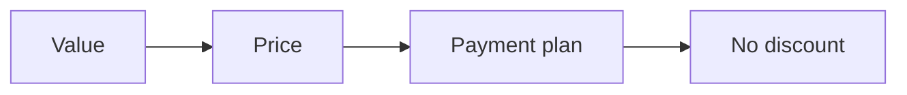

# Pricing checklist

Run this list to set and defend the price of the offer.

Price follows value, not the clock.

## Before you start
- [ ] Get the one currency and the roadmap.
- [ ] Get the value of one client.
- [ ] Read the offer playbook.

## Steps
- [ ] Set the premium price at $3,000 or more.
- [ ] Check the price against the value of one client.
- [ ] Work out the funnel math at this price.
- [ ] Plan a payment plan.
- [ ] List what each payment buys.
- [ ] Write the guarantee or the no-guarantee rule.
- [ ] Practice saying the price out loud.
- [ ] Never discount. Offer a shorter path instead.
- [ ] Add a small entry offer if it helps.
- [ ] Check the entry offer solves one step only.
- [ ] Review the price after 90 days.

## Done when
- [ ] The price is set and defensible.
- [ ] A payment plan exists.
- [ ] The funnel math works at this price.
- [ ] No discount is offered.
