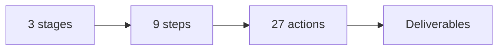

# Product roadmap checklist

Run this list to turn the offer into a roadmap with three stages and nine steps.

The shape is always three by three by three.

## Before you start
- [ ] Get the one currency and message.
- [ ] Run the digital brain dump first.
- [ ] Read the offer playbook.

## Steps
- [ ] Group the dump into three stages.
- [ ] Break each stage into three steps.
- [ ] Break each step into three actions.
- [ ] Run the weakest-link test on every step.
- [ ] Name each stage in plain words.
- [ ] Give every step one clear action.
- [ ] Give every step one deliverable.
- [ ] Name the roadmap for the person and the result.
- [ ] Check every step uses the one currency.
- [ ] Check the path moves from pain to goal.
- [ ] Get feedback before design.

## Done when
- [ ] There are three stages and nine steps.
- [ ] Every step has an action and a deliverable.
- [ ] The path uses the one currency.
- [ ] The roadmap is approved.
