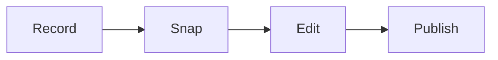

# Recording and editing checklist

Run this list to record and edit one video fast.

Record one slide at a time to make editing quick.

## Before you start
- [ ] Finish the slides.
- [ ] Write short speaker notes.
- [ ] Test the camera, mic, and light.

## Steps
- [ ] Record in a quiet room with good light.
- [ ] Record one slide per take.
- [ ] Clap or snap at the start of each take.
- [ ] Record in wide screen at high quality.
- [ ] Keep each video between 5 and 30 minutes.
- [ ] Cut at the clap or snap marks.
- [ ] Smooth the sound and remove noise.
- [ ] Add captions.
- [ ] Export the video.
- [ ] Host the video on a video site.
- [ ] Test the video on the page.

## Done when
- [ ] The video is clear and easy to hear.
- [ ] The sound is smooth.
- [ ] Captions are added.
- [ ] The video plays on the funnel page.
