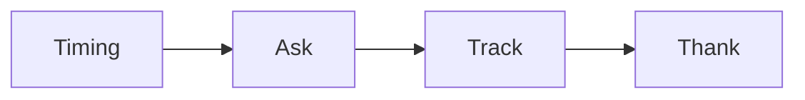

# Referral and partner checklist

Run this list when a client is happy and has real results.

The loop has four parts.

## Before you start
- [ ] Confirm the client has a win to point to.
- [ ] Know who they might refer.
- [ ] Have a simple way to track referrals.
- [ ] Pick a partner type that fits.

## Steps
- [ ] Wait for a happy moment, like a result or a kind word.
- [ ] Ask one clear question: who else needs this?
- [ ] Make the ask easy. Give a short note they can forward.
- [ ] Ask if they want to be a partner.
- [ ] Write the referral in the tracker.
- [ ] Follow up with the new lead fast.
- [ ] Thank the client in a real way.
- [ ] Tell them what happened with the referral.

## Done when
- [ ] The ask is made.
- [ ] The referral is tracked.
- [ ] The client is thanked.
