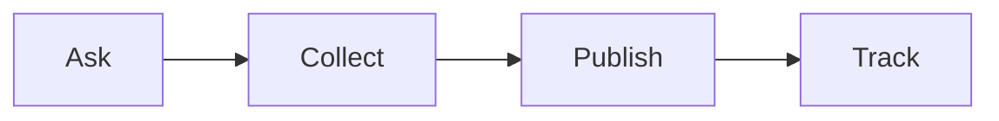

# Reputation track checklist

Run this list to collect reviews, stories, and press.

The track has four parts.

## Before you start
- [ ] List the places to get reviews.
- [ ] Have a short ask you can send.
- [ ] Pick where to publish stories.
- [ ] Set up one place to track it all.

## Steps
- [ ] Ask happy clients for a review at the right time.
- [ ] Make the ask short and easy.
- [ ] Collect the review or story in one place.
- [ ] Ask for a press or podcast spot.
- [ ] Publish the review on your site.
- [ ] Share the story with the community.
- [ ] Track each review and its source.
- [ ] Say thank you to each person.

## Done when
- [ ] New reviews are collected.
- [ ] Stories are published.
- [ ] Every item is tracked.
- [ ] Every person is thanked.
