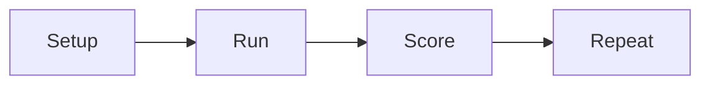

# Role-play drill checklist

Run this list to practice the enrollment call with your team.

The drill has four parts.

## Before you start
- [ ] Pick one call stage to practice.
- [ ] Print the script and the checkpoint card.
- [ ] Pick who plays the lead and who plays the seller.
- [ ] Set a timer for 15 minutes.

## Steps
- [ ] Read the stage goal out loud.
- [ ] Run the call from start to end.
- [ ] Do not stop to fix things mid-call.
- [ ] Score the call on the checkpoint card.
- [ ] Name one thing that went well.
- [ ] Name one thing to fix.
- [ ] Swap roles and run it again.
- [ ] Repeat until the score is high.

## Done when
- [ ] Both people have played both roles.
- [ ] The score is high on every gate.
- [ ] One fix is chosen for the next drill.
